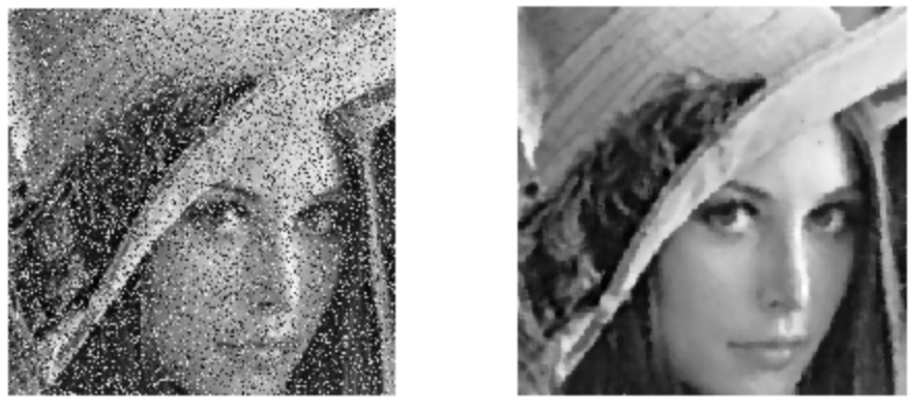
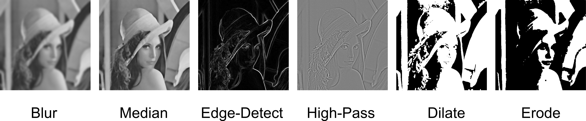
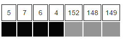
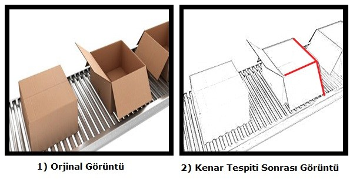
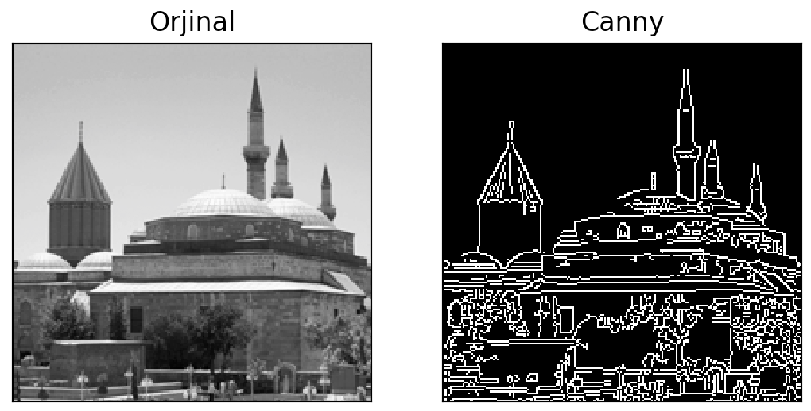

**Filtreleme ve Kenar Belirleme Algoritmaları** 
-----------------------------------------------

Bu bölümde görüntü üzerindeki gürültüleri temizlemek, görüntü üzerindeki nesnelerin kenarlarını tespit etmek veya görüntüyü ön işlem ile analiz etmek için kullanılabilecek algroritmaların OpenCV kütüphanesi ile nasıl kullanılabileceğine bakacağız.

 ## Filtreleme

Filtre konusuna geçmeden önce öncelikli olarak gürültü kavramına bakmakta fayda var. Gürültü; hareket veya atmosferik kararsızlık nedeniyle meydana gelen bulanıklaşma veya resmi çekerken yanlış ışık etkisinden dolayı focus bulanıklaşması, kusursuz olmayan lenslerden kaynaklanan geometrik bozulma ve elektronik kaynaklardan gelen hatalar olarak verilebilir. Bu konuyu daha detaylı öğrenmek isterseniz olarak ele aldığım görüntü bozulmaları ve kamera kalibrasyonu konusuna bakabilirsiniz.

Filtreler genellikle ön işlem veya gürültü temizleme için kullanılırlar. Temel olarak görüntüyü bir fx fonksiyonuna sokararak filtre sabitini kullanır bu sayede görüntü üzerinde yer alan piksel değerlerinde bazı değişiklikler meydana gelir, sonuç olarak görüntü değişime uğrar. Instegram, mobil fotoğraf düzenleme uygulamaları veya profesyonel görüntü düzenleme programlarında filtrelere rastlamışsınızdır. Bundan önceki ilk iki konuda ele alınan örneklere dikkat ederseniz çıktı olarak oluşturulan görsellerde bazı piksellerin kaydığını, silik çıktığını veya tam olarak temizlenemediğini görürsünüz. Farklı görseller ile bu örnekleri yaptıysanız benzer sonuçlarla karşılaşmışsınızdır. Bunun nedeni kaynak olarak alınan görüntünün gürültülü olması veya ışık dengesinin bozuk olması gibi birçok durumdur. Bu sorunları aşmak için kaynak görüntüye öncelikle bir filtre uygulanır ve görüntünün işleme için en verimli hale getirilmesi sağlanır ve bu durum ön işleme olarak adlandırılır.



**Blur**

Blur filtresi görüntüyü bulanıklaştırmak için kullanılır. Uygulamak için ise blur() metodu kullanılır. Bu metot parametre olarak kaynak görüntü mat nesnesi tipinde, mat tipinde bir sonuç ve Size tipinde uygulanacak olan bulanıklık değerini almaktadır.(çekirdek boyutu olarak da adlandırılır).

*Java:*

``` Java
Imgproc.blur(kaynakGoruntu, hedefGoruntu, new Size(50,50));
```

*Python:*
```Python
hedefGoruntu = cv2.blur(kaynakGoruntu,(50,50))
```

**GaussianBlur**

GaussianBlur filtresi görüntü üzerinde düzleştirme işlemi uygular. Uygulamak için GaussianBlur() metodu kullanılır. Bu metot parametre olarak kaynak görüntü mat nesnesi tipinde, mat tipinde bir sonuç ve Size tipinde uygulanacak olan bulanıklık değerini (çekirdek boyutu olarak da adlandırılır) ve SigmaX olarak adlandırılan çekirdek standart sapmasıdır almaktadır.

*Java:*

``` Java
Imgproc.GaussianBlur(kaynakGoruntu, hedefGoruntu, new Size(100,100),0);
```

*Python:*
```Python
hedefGoruntu = cv2.GaussianBlur(kaynakGoruntu,(100,100),0)
```

**Laplace**

Görüntü üzerinde nesnelerin sınır çizgilerini belirlemek için kullanılır. Piksellerin renk farklılıklarından yararlanır ve bu sayede nesnelerin sınır çizgileri tespit edilmiş olur. Uygulamak için Laplacian() metodu kullanılır. Bu metot parametre olarak kaynak görüntü mat nesnesi tipinde, mat tipinde bir sonuç ve int tipinde derinlik değeri almaktadır.

*Java:*

``` Java
Imgproc.Laplacian(kaynakGoruntu, hedefGoruntu,20);
```

*Python:*
```Python
hedefGoruntu = cv2.Laplacian(kaynakGoruntu,cv2.CV_64F)
```

**Sobel**

Görüntü üzerindeki kenarları elde etmek için kullanılır. Görüntü üzerindeki nesneleri kenarları belirleyerek ayrıştırmak istendiğinde bu filtreden yararlanılır.  Uygulamak için Sobel() metodu kullanılır. Bu metot parametre olarak kaynak görüntü mat nesnesi tipinde, mat tipinde bir sonuç, int olarak çıkış görüntü nesnesi için derinlik ve int tipinde türev olarak adlandırılan x, y değeri.

*Java:*

``` Java
Imgproc.Sobel(girisGoruntu, cikisGoruntu, ddepth, dx, dy);
```

*Python:*
```Python
cikisGoruntu = cv2.Sobel(girisGoruntu,cv2.CV_8U,1,0,ksize=5)
```


Diğer OpenCV içerisinde bulunan filtreleri ise aşağıda yer almaktadır.

* pyrMeanShiftFiltering()
* boxFilter()
* filter2D()
* Scharr()
* pyrUp()
* pyrDown()
* sepFilter2D()
* buildPyramid()



 ## Kenar Belirleme

 Görüntü üzerinde kenar tespiti yapmak; o görüntüdeki nesneleri tespit etmek, saymak ve özelliklerini belirlemek amacıyla kullanılabilir. Kenar belirleme algoritmaları en temel anlatımıyla, görüntü üzerindeki piksellerin renk değerlerinin bir birlerinden farklılaşması ile belirlenir.




 Yukarıdaki görsele baktığınızda farklılaşmanın nereden başladığını tahmin edebilir misiniz? Gördüğünüz üzere 4 ve 152 numaralı matris elemanları arasında keskin bir renk geçişi olmuş, bu renk geçişi (gürültü olmadığı taktirde) iki farklı nesnenin başlangıç ve bitiş çizgilerini ifade edebilir. İşte bu geçişler bizim için kenar çizgilerini ifade etmektedir. Örnek matrisimiz görüldüğü üzere gri (Gray) renk uzayına sahip bu renk uzayında matris elemanları yani pikseller 0-255 arasında renk değerlerine sahipti eğer görüntümüzü siyah-beyaz renk uzayına çevirir ve 0-1 aralığında renk kodları alması işimizi kolaylaştırmaz mı? İşte bu noktada kenar çıkarımı yapmadan Thresholding (Eşikleme) yapmamız işe yarayabilir. Bu uygulama şeklinde her algoritma kendisine has çıkarımlar yaparak tespit edebilir, bu yüzden görüntümüz de hangisinin daha iyi sonuç verdiğini deneyerek göreceğiz. Aşağıdaki görselde kenar çıkarma algoritması uygulanmış bir görüntü görmektesiniz. Bu görüntü üzerinde geçen kolileri saymak için ideal bir yöntem olabilir mi?

 


 Kenar belirlemek için geliştirilmiş bir çok algoritma vardır ve bu algoritmaların neredeyse tamamına yakını OpenCV içerisinde mevcuttur.

Başlıca kenar belirleme algoritmaları:
* Canny
* Sobel
* Prewitt
* Lablacian
* Zero-Cross

Bu algoritmalar içerisinden Canny algoritması verdiği başarılı sonuçlar neticesinde en sık kullanılandır.

Canny:

*Java:*

``` Java
Imgproc.Canny(input_mat, detected_edges_mat, lowThreshold, maxThreshold, kernel_size );
```

input mat kenar tespiti yapacağımız matrisimiz, detected_edges_mat işlem sonucu kenarları tespit edilmiş mat nesnemiz, eşikleme yani thresholding yapacağımız için istediğimiz minimum değeri , maxThreshold ise eşikleme için kullanılmasını istediğimiz maksimum eşik değeri, kernel_size  parametresi ise çekirdek matrisi tanımlamaktadır bu rada önerilen matris değerlerini kullanabilir özel matris oluşturabilir istersek de boş bırakarak varsayılan çekirdek matrisin kullanılmasını sağlayabiliriz.

*Java:*

``` Java
 public static void main(String args[]) {
        String NATIVALIBRARYx64 = "res//lib//x64//opencv_java310";
        System.loadLibrary(NATIVALIBRARYx64);
        Mat imageInMat = Imgcodecs.imread("mevlana.jpg");
        Mat canny = new Mat();
        Imgproc.Canny(imageInMat, canny, 50, 150);
        Imgcodecs.imwrite("mevlana_canny.jpg", canny);
    }
```

*Python:*

``` Python
import cv2
import numpy as np
from matplotlib import pyplot as plt

img = cv2.imread('mevlana.jpg',0)
edges = cv2.Canny(img,50,150)

plt.subplot(121),plt.imshow(img,cmap = 'gray')
plt.title('Orjinal'), plt.xticks([]), plt.yticks([])
plt.subplot(122),plt.imshow(edges,cmap = 'gray')
plt.title('Canny'), plt.xticks([]), plt.yticks([])

plt.show()
```

