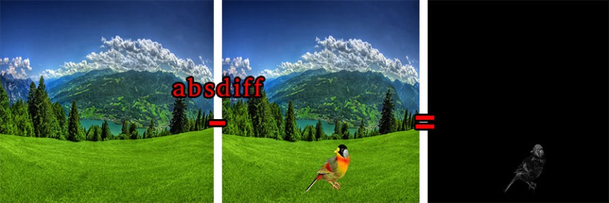
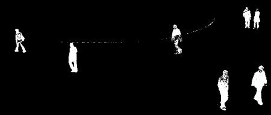
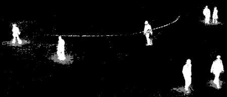
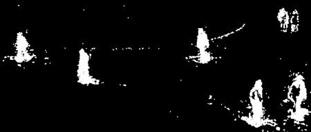

**Arka Plan Çıkarma Algoritmaları** 
-----------------------------------

Arka plan çıkarma işlemi, 2 boyutlu bir görüntü üzerinde derinlik bilgisi olmaksızın görüntüde yer alan nesnelerin arka planını tespit etmektir. Peki arka plan çıkarma işlemine neden ihtiyaç duyarı? En temel sebeplerine bakarsak; görüntü üzerindeki nesneleri saymak, hareket halindeki bir nesneyi yakalamak ve analiz etmek, nesne tanımada ön işleyici olarak kullanmak, başlı başına hareket tespiti yapmak vb. 

OpenCV ile arka plan tespit işlemi için eklenmiş birçok algoritma mevcuttur. Başlıcaları:


NOT: Stero yani derinlik bilgisi olan görüntüler üzerindeki süreç burada göreceğimizden biraz farklıdır bu yüzden anlatılanlar 2 boyutlu görüntü üzerinden olacaktır.

* Absdiff
* BackgroundSubtractorMOG
* BackgroundSubtractorMOG2
* BackgroundSubtractorGMG


**Absdiff (İki Matris Farkı)**

Absdiff metodu parametre olarak verilen iki mat nesnesi yani matris arasında çıkarma işlemi yapar bu çıkarma işlemi sonucunda değişen kısımlar (hareketli kısımlar) sonuç olarak gösterilir ve çıkarma işlemi sonucu mutlak değer olarak döndürülür.

Arka plan temizleme, genellikle nesnelerin belirlenmesi, sayılması veya karşılaştırılması gibi işlemler için tercih edilir. Örneğin kapı girişlerine yerleştirilen bir kamera ile içeri giriş yapan kişi sayısı hesaplanabilir. Kamera yerleştirildikten sonra bir görüntü alınır ve arka plan olarak saklanır, daha sonraki her görüntü ile arka plan arasında bir çıkarma işlemi yapılır, çıkarma işlemi sonucunda oluşan görüntüye morfolojik operatörler ve thresholding uygulanarak fark sonucunda görüntü üzerindeki nesne belirlenir ve sayılır. Bu sayede giriş yapan kişi sayısı elde edilebilir. Bu algoritma kullanım alanı için basit bir örnek teşkil etmektedir.


*Java:*

``` Java
	
import  org.opencv.core.Core;
import org.opencv.core.Mat;
import org.opencv.highgui.Highgui;
import org.opencv.imgproc.Imgproc;
 
public class ArkaplanTemizle  {
 
	public static void main(String[] args) {
		System.loadLibrary(Core.NATIVE_LIBRARY_NAME);		
		
		Mat kaynakMatris = Highgui.imread("/home/mesutpiskin/Masaüstü/1.jpg");
		Mat kaynakMatrisGray = new Mat();
		//RGB UZAYINDAN GRAY UZAYINA ÇEVİRME
		Imgproc.cvtColor(kaynakMatris, kaynakMatrisGray,Imgproc.COLOR_RGB2GRAY);	
	
		Mat hedefMatris = Highgui.imread("/home/mesutpiskin/Masaüstü/2.jpg");
		Mat hedefMatrisGray = new Mat();
		//RGB UZAYINDAN GRAY UZAYINA ÇEVİRME
		Imgproc.cvtColor(hedefMatris, hedefMatrisGray,Imgproc.COLOR_RGB2GRAY);
		
		//ARKA PLAN TEMİZLENDİKTEN SONRAKİ VERİLERİ TUTACAK MATRİS
		Mat yeni=new Mat();
		/*
		 * hedefMatrisGray: Yakalanan anlık resim
		 * kaynakMatrisGray: Temel alınacak bir önceki resim
		 * yeni: Çıkarma işlemi sonucunda oluşacak  verileri tutacak matris
		 * absdiff metodu matrisler arası bir çıkarma işlemi yapıyor.
		*/
		Core.absdiff(hedefMatrisGray,kaynakMatrisGray, yeni);
		//ÇIKARMA İŞLEMİ SONUCU OLUŞAN MATRİSİ KAYDET
		Highgui.imwrite("/home/mesutpiskin/Masaüstü/yeni.jpg", yeni);
	}
 
}
```

*Python:*
```Python
import cv2
img1 = cv2.imread('resim.jpg')
img2 = cv2.imread('resim2.jpg')
fark = cv2.absdiff(img1, img2)
cv2.imshow('Sonuc',fark)
cv2.waitKey(0)
```




**BackgroundSubtractorMOG**

Bu algoritma, 2001 yılındaki P. KadewTraKuPong and R. Bowden tarafından yazılan “An improved adaptive background mixture model for real-time tracking with shadow detection” başlıklı makaladen yola çıkarak geliştirilmiştir. Bu yöntem ön bölünmüş segmentasyon algoritması olarak da geçmektedir. 



**BackgroundSubtractorMOG2**

Bu algoritma, Z.Zivkovic tarafından ele alınan 2004 yılındaki “Improved adaptive Gausian mixture model for background subtraction” ve  2006 yılındaki “Efficient Adaptive Density Estimation per Image Pixel for the Task of Background Subtraction” makalelerden yola çıkarak geliştirilmiştir. Bu algoritmanın önemli bir özelliği, Her piksel için uygun sayıda Gauss dağılımı seçer, bu farkı uygulamada seçebiliyor olacağız.



**BackgroundSubtractorGMG**

BackgroundSubtractorGMG algoritması OpenCV içerisine daha yakın bir tarihte eklenmiş bir yöntemdir. Arka plan ayırımı için daha başarılı bir yöntemdir. Bu yöntem 2012 yılında Andrew B. Godbehere, Akihiro Matsukawa, Ken Goldberg  tarafından yazılan “Visual Tracking of Human Visitors under Variable-Lighting Conditions for a Responsive Audio Art Installation” başlıklı makalelerinden yola çıkılarak geliştirildi. Arka plan modellemesi için ilk birkaç (varsayılan 120) çerçeve kullanır. Olası ön plan nesnelerini Bayes çıkarımı kullanarak tanımlayan olasılıksal önplan bölümleme algoritmasını kullanır. Tahminler uyarlanabilir; Değişken aydınlatmaya uyum sağlamak için daha yeni gözlemler daha eski gözlemlerden daha ağırlıklıdır. İstenmeyen gürültüyü gidermek için kapanma ve açma gibi çeşitli morfolojik filtreleme işlemleri yapılır.




*Java:*

``` Java
	
import org.opencv.core.Mat;
import org.opencv.video.BackgroundSubtractor;
import org.opencv.video.BackgroundSubtractorMOG2;
import org.opencv.videoio.VideoCapture;

public class Ornek {
    public static void main(String[] args){
        VideoCapture capture = new VideoCapture(0);
          Mat camImage = new Mat();
          BackgroundSubtractorMOG2 backgroundSubtractorMOG = Video.createBackgroundSubtractorMOG2();
            if (capture.isOpened()) {
                while (true) {
                    capture.read(camImage);


                    Mat fgMask=new Mat();
                    backgroundSubtractorMOG.apply(camImage, fgMask,0.1);

                    Mat output=new Mat();
                    camImage.copyTo(output,fgMask);

                    //output nesnesini kullanabilirsiniz
                   }
                }
    }
}
```

*Python:*
```Python
import numpy as np
import cv2
cap = cv2.VideoCapture(0)
kernel = cv2.getStructuringElement(cv2.MORPH_ELLIPSE,(3,3))
fgbg = cv2.createBackgroundSubtractorGMG()
while(1):
    ret, frame = cap.read()
    fgmask = fgbg.apply(frame)
    fgmask = cv2.morphologyEx(fgmask, cv2.MORPH_OPEN, kernel)
    cv2.imshow('GORUNTU',fgmask)

cap.release()
cv2.destroyAllWindows()
```