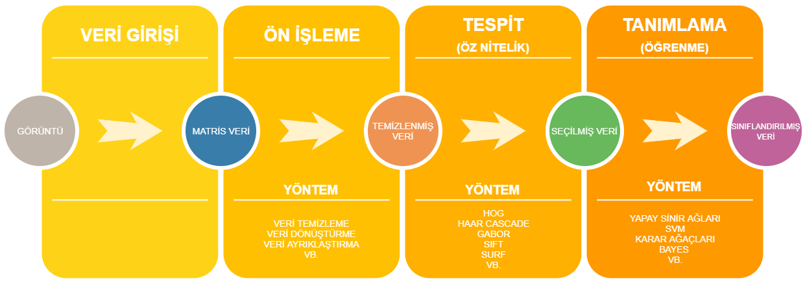
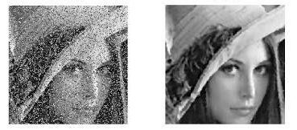
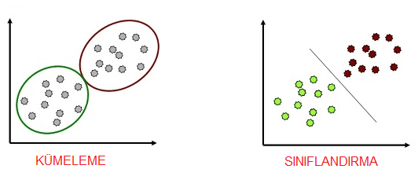
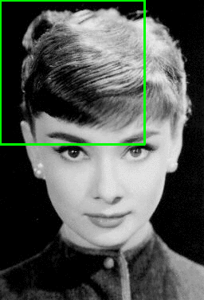
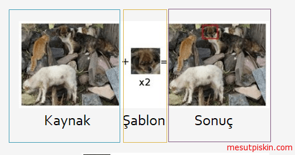
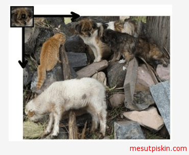
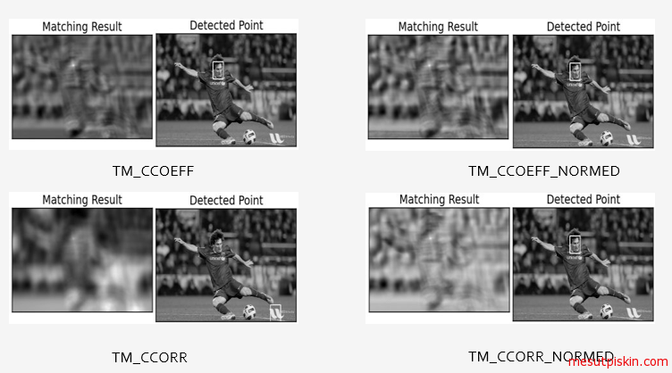
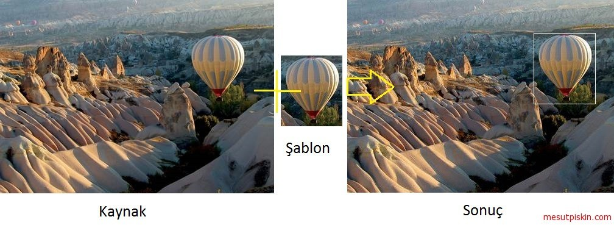
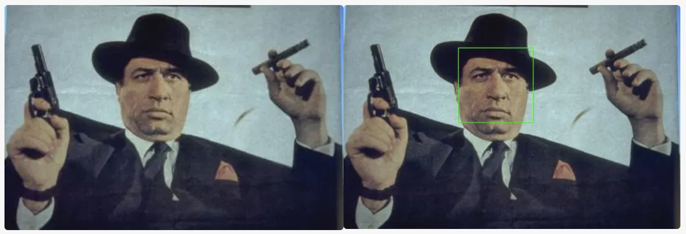
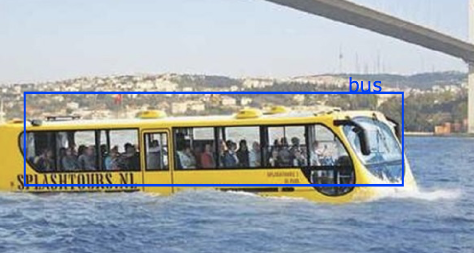

**Nesne Tespiti** 
-----------------


Nesne tespiti ve nesne tanıma uzun zamandır bilgisayarlı görü uygulamaları için vazgeçilmez bir ihtiyaçtı. Yıllardır üzerinde çalışan bu konu için farklı algoritmalar geliştirildi fakat devrim niteliğindeki algoritma 2o01 yılında  Paul Viola ve Michael Jones tarafından geliştirilen Viola Jones algoritması oldu. Bu algoritma “Rapid Object Detection using a Boosted Cascade of Simple Features” [1] başlıklı makale ile duyuruldu. Takip eden süreçte bir çok algoritma geliştirildi. Yakın zamanda ise kullanılmaya başlayan GPU teknolojisi ile hız kazanan derin öğrenme sayesinde çok daha fazla doğruluk oranı ile tanımlama yapabilen yöntemler geliştirildi.

## Nesne Tespit ve Tanıma Süreçleri

Bu bölümde nesne tespit ve tanıma süreçlerini 5 ana başlık altında inceleyeceğiz.  Veri girişi, veri ön işleme ve aşamaları, öznitelik çıkarımı ve öz nitelik seçimi son olarak ise tanımlama olarak adlandırdığımız veri sınıflandırma aşamalarını göreceğiz.  Bu süreçler aşağıdaki görsel de özetlenmiştir.




**Veri Girişi:**

Bu aşmada hazırlanan veri gürültülerinden ayrıştırılmak, istenilen formata getirilmek gibi amaçlara sisteme girdi olarak verilir. Nesne tespit veya sınıflandırma işlemi yapacağımız için verilerimiz de doğal olarak görüntü olacaktır. Bir insan, otomobil veya ev istediğimiz veriye örnekken, üzerinde insan bulunan bir orman fotoğrafı girdi olarak tanımlanabilir. Fotoğraf makineleri ile çekilmiş fotoğraflar, dijital olarak oluşturulmuş resimler, video filmler ve taranmış metinler bu veri türlerine örnektir. Veri formatı kullanılan teknolojiye, dile, platforma vb. bir çok etkene bağlıdır fakat kullanacağımız algoritmalar için geçerli format matris haline getirilmiş görüntü pikselleridir.


**Ön işleme:**

Verilerin yapılacak olan işlemin  amacına uygun hale gelmesi için hazırlamak veya engel teşkil etmesinin önüne geçmek için uygulanan bir takım sabit olmayan yöntemlerdir. Sabit olmayan diyorum çünkü ön işlem süreçleri veriye, istere, duruma ortama gibi bir çok farklı etmene göre değişebilen genellikle önceden bilinemeyen, deneyle, deme yanılma ile karar verilen yöntemlerdir. Daha somut bir örnekle açıklayalım; Daha öncede verdiğimiz örnekten yola çıkarak orman içerisindeki insanları tespit etmek ve etiketlemek istediğimizi düşünelim, etiketleme kavramını nesnenin ne olduğunu belirtmek anlamında kullandığımı da belirtmekte fayda var. Bir algoritmada karar kıldık örnek verilerden yola çıkarak sonucun başarılı olacağına karar verdik ve test için hazir hale getirdik. Fakat test için verilen girdilerde fotoğraf makinesi kaynaklı oluşmuş piksel bozuklukları olduğunu düşünelim bu durumda sonuç beklediğimiz gibi çıkar mı? Ayni sekilde verilen bir görüntüde çekim açısından kaynaklanan parlakliklar var ve görüntüyü bozuyor, bu durumda düzgün veri hazırlamayan kullanıcıyı mı, yoksa algoritmanın bu hataları farkedemeyecek kadar kötü olduğunu düşünerek algortimayimi suclsmaliyiz. Tabiki de hayır burada yapılması gereken şey bu gibi durumlara önlem almadığımız için kendimizi suclayabiliriz. Peki ne yapmalıyız?

Veri ön işlemenin nedenlerini  siralamak gerekirse; gürültülü parazitli veriler, tam olmayan eksik veriler ve tutarsız veriler olarak sayabiliriz. Peki bunlari nasıl yapabiliriz?

Veri ön işleme için bir çok algortima veya yöntem mevcuttur, bu yöntemler insan gözü ile denetleme olabileceği gibi karmaşık sinir ağları bile olabilir. Bu yöntemleri de siralamak istersek; Regresyon, esikleme, kümeleme, filtreleme, binnig, karar ağaçları vb. diyebiliriz. Unutulmaması gereken bir diğer nokta ise bazılen  tek başına bir yöntemi uygulamak yeterli gelmeyebilir, bu durumlarda bir kaç farklı yöntemi peş peşe kullanabiliriz.



**Öznitelik:**

Bu aşamada ön işleme tabi tutulmuş veri üzerinde daha önceden belirlenen nesnenin/isterin elde edilmesidir. Bu bölümde öznitelik çıkarma (feature extraction) kavramına değinmek gerekiyor. Feature extraction; “Detay çıkarma: Bir cismin önceden tanımlanmış kriterleri ve özellikleri sayesinde görüntüler üzerinden otomatik olarak tespit edilmesi ve detaylarının elde edilmesi işlemi; eşanlam: detay saptama.” ve “Öznitelik çıkarma: Örüntü tanıma ve istatistiksel işaret işlemede, sınıflandırma amacıyla alınan ölçümlerin bazı dönüşümlerle daha özlü, daha az gürültülü, daha az sayıda ayırt edici değerlere dönüştürülmesi.” [3] Bu tanımı bazı kaynaklarda özellik çıkarımı olarak da görebilirsiniz.

Bir örnekle durumu anlaşılır hale getirelim. Yukarıdada değindiğimiz bir örnek vardı; orman içerisindeki insanları tespit etmek.  Bu aşmada her nesneye özel bir öznitelik çıkarımı tanımlamak gerekebilir. Örneğimize dönecek olursak, ormandaki bir insanı nasıl ayırt edebilir? Ağaçlar yeşildir ve belirli bir formu vardır bunu tanımlayıp dışında kalanlara insan diyebilir miyiz? Duruma göre belki evet ama genel olarak cevap hayır. İnsan vücudunun sabit bir formu var peki bunu tanımlasak nasıl olur? İnsanın 2 adet ayağı bu ayak zeminin hemen üzerinde bir birlerine paral olabilir diyebilir miyiz? Evet diyebilir ama zemini de tanımlamamız gerekiyor.  Gördüğünüz gibi çok fazla tanımlamamız gerek şey var. Bunları tek tek matematiksel olarak tanımlayabileceğimiz gibi algoritmaya öğretebiliriz de, bu ihtiyaca ve probleme göre değişkenlik gösteren bir durum.

Bu işlemler sonunda elde edeceğimiz şey , istediğimiz nesnenin görüntü üzerine var mı, varsa nerede olduğudur. Peki bu yöntemler nedir? Öznitelik çıkarımı için kullanabileceğiniz yüzlerce algoritma var kısaca bir kaçını saymak gerekirse SIFT (Scale-Invariant Feature Transform), SURF (Speeded-Up Robust Features), Feature Matching, Haar Cascades, HOG (Histogram of Oriented Gradients) vb. diyebiliriz.


**Tanımlama:**

Tanımlama, tespit ettiğimiz görüntüden çıkarım yapabilmek, tanımak yani bu görüntünün ne olduğunu anlama aşaması olarak basitce tanımlanabilir. Bu bölümde temek iki kavrama değinmek gerekiyor; Sınıflandırma ve Kümeleme. Sınıflandırma veriyi önceden belirlenmiş sınıflardan birine dahil etmektir. Danışmanlı (Gözetimli, Supervised) öğrenme, kestirim ve örüntü tanıma yöntemleri ile gerçekleştirilir. Kümelemede ise  benzer verileri, benzer özellik gösterenler aynı grupta toplanırlar.




## Nesne Tespit ve Tanıma Algoritmaları

OpenCV içerisinde nesne tespit ve tanıma için eklenmiş birçok algoritma mevcuttur. Bu bölümde popüler bazı algoritmaları göreceğiz, bunlar:

* Template Matching (Şablon Eşleştirme)
* Cascade Sınıflandırıcısı
* LBP – Local Binary Pattern
* HOG – Histogram of Oriented Gradients
* Derin Sinir Ağı (DNN)
* Evrişimli Sinir Ağları (CNN)


## Template Matching (Şablon Eşleştirme)

Template Matching (Şablon Eşleştirme) yöntemi ile nesne tanıma daha çok kaynak bir görüntü üzerinde bir şablonu aramak için kullanılır. Nesneleri ayırt etmede çok fazla başarılı değildir. Örneğin, bir meyve sepeti bulunan görüntü üzerinde elmayı aramak için kullanılabilir. Aranan kaynak üzerinde verdiğiniz şablon birebir olarak aranır, başarılı bir sonuç için aradığınız elma görüntüsünün, meyve sepeti görselinden kırpılmış olması gerekebilir. Kırmızı bir elmayı şablon olarak tanımladınız ve meyve sepetinde aradınız, eğer meyve sepetinizde yarısı kesilmiş yarım bir elma var ise başarılı sonuç alamayacaksınız çünkü şablonunuzda ki ile kaynak görsel üzerinde yer alan elma aynı ölçülerde değildir.

Template Matching yöntemi ile kaynak görsel üzerinde aranan şablon Sliding window (Kayan,sürgülü pencere) yöntemi ile aranır. Kaynak üzerinde şablon (1,1) koordinatlarına oturtulur ve tüm pikseller üzerinde dönülür, kullandığınız benzerlik yöntemine göre bir benzerlik oranı oluşturulur ve şablonunuz ile  o anki dönülen şablon benzer ise sonuç olarak size o pikselleri döndürür.



Yukarıdaki görselde, solda yer alan hayvanlar kaynak görüntü olarak alınmış buradaki bir köpeğin yüzü kırpılarak alınmış ve şablon olarak kullanılmış işlem sonucunda ise verilen şablon ile aynı ölçüde bir sonuç çıkmıştır. Kaynak değiştirilmiş olsaydı ve aynı köpek farklı ışık açısı, farklı poz veya farklı bir zemin üzerinde olsaydı sonuç yukarıdaki kadar başarılı olmayacaktı.

 


Kaynak üzerinde şablon aranırken, yukarıda olduğu gibi 0,0 koordinatlarına istenilen şablon oturtulacak soldan sağa ve yukarıdan aşağıya doğru tüm matris elemanları yani pikseller üzerinde dönülmektedir. Template Matching  yönteminde kaynak ile şablonu eşleştirirken kullanılan farklı yöntemler vardır. Bu yöntemler aşağıdaki gibidir.

* TM_CCOEFF
* TM_CCOEFF_NORMED
* TM_CCORR
* TM_CCORR_NORMED
* TM_SQDIFF
* TM_SQDIFF_NORMED

Bu yöntemlerin bir birleri arasındaki farkları örnek görseller ile anlayabilir. Bu yöntemlerin her birinin farklı bir matematiksel formül olduğunu unutmayalım.



*Java:*

``` Java
import org.opencv.core.Core;
import org.opencv.core.Core.MinMaxLocResult;
import org.opencv.core.Mat;
import org.opencv.core.Point;
import org.opencv.core.Scalar;
import org.opencv.imgcodecs.Imgcodecs;
import org.opencv.imgproc.Imgproc;

public class TemplateMatching {

	public static void main(String[] args) {
		
		System.loadLibrary(Core.NATIVE_LIBRARY_NAME);
		Mat source=null;
		Mat template=null;
		String filePath="C:\\Users\\mesutpiskin\\Desktop\\Object Detection\\Template Matching\\Sample Image\\";
		source=Imgcodecs.imread(filePath+"kapadokya.jpg");
		template=Imgcodecs.imread(filePath+"balon.jpg");
	
		Mat outputImage=new Mat();	
		int machMethod=Imgproc.TM_CCOEFF;
   
        Imgproc.matchTemplate(source, template, outputImage, machMethod);
 
    
        MinMaxLocResult mmr = Core.minMaxLoc(outputImage);
        Point matchLoc=mmr.maxLoc;

        Imgproc.rectangle(source, matchLoc, new Point(matchLoc.x + template.cols(),
                matchLoc.y + template.rows()), new Scalar(255, 255, 255));

        Imgcodecs.imwrite(filePath+"sonuc.jpg", source);
        System.out.println("İşlem tamamlandı.");
	}

}
``` 

*Python:*

```Python

import cv2
import numpy as np
from matplotlib import pyplot as plt

img = cv2.imread('balon.jpg',0)
template = cv2.imread('kapadokya.jpg',0)
w, h = template.shape[::-1]

# Karşılaştırma için kullanılacak 6 yöntem
methods = ['cv2.TM_CCOEFF', 'cv2.TM_CCOEFF_NORMED', 'cv2.TM_CCORR',
            'cv2.TM_CCORR_NORMED', 'cv2.TM_SQDIFF', 'cv2.TM_SQDIFF_NORMED']

for meth in methods:
    img = img2.copy()
    method = eval(meth)

    # Şablon eşleştirmeyi uygula
    res = cv2.matchTemplate(img,template,method)
    min_val, max_val, min_loc, max_loc = cv2.minMaxLoc(res)

    if method in [cv2.TM_SQDIFF, cv2.TM_SQDIFF_NORMED]:
        top_left = min_loc
    else:
        top_left = max_loc
    bottom_right = (top_left[0] + w, top_left[1] + h)

    cv2.rectangle(img,top_left, bottom_right, 255, 2)

    plt.subplot(121),plt.imshow(res,cmap = 'gray')
    plt.title('Matching Sonuc'), plt.xticks([]), plt.yticks([])
    plt.subplot(122),plt.imshow(img,cmap = 'gray')
    plt.title('Tespit Noktaları'), plt.xticks([]), plt.yticks([])
    plt.suptitle(meth)

    plt.show()

```


matchTemplate metodu parametre olarak mat tipinde kaynak görsel, şablon görsel ve çıktı için kullanacağı mat nesnesini, int tipinde ise eşleştirme yöntemini almaktadır. Örnekte bir kaynak görsel yükledik bu görsel üzerinden kırpılmış bir görsel şablon olarak eklendi. Sonuç için bir mat nesnesi tanımlandı. Bu çıktı matrisi şablonun ölçüleri kullanılarak boyutlandırıldı. Kaynak görsel üzerinde sonuç nesnesi boyutları kullanılarak bir kare çizildi, kare için bir scalar yani renk tanımlandı (255,255,255  rgb renk kodları)  ve sonuç aynı dizine yazıldı.




Video Anlatım:

[](https://youtu.be/MhZtXgXtzNs)


## HaarCascade Classifier

Nesneyi tespit etmek için öncelikle nesneyi sisteme tanıtmamız ve daha sonra bu tanımlanmış modeli kullanarak görüntü üzerinde arama yapmamız gerekir. Haar cascade sınıflandırıcısı bizden xml tipinde model dosyası alır bu xml dosyaları bir nesnenin binlerce negatif ve pozitifi ile hazırlanmış veri setidir. Pozitif olarak tanımlanan görüntüler istenilen nesnenin bulunduğu negatif olarak tanımlananlar ise bulunması istenilen nesnenin bulunmadığı görüntülerdir. OpenCV içerisinde bir çok model hali hazırda eğitilmiş olarak gelir.

[](https://youtu.be/Cqtzwhq3IuA)


*Java:*

``` Java

public class DetectFace {
 
	public static void main(String[] args) {
		System.loadLibrary(Core.NATIVE_LIBRARY_NAME);
		/*Cascade Classifier için öðretilmiş veri kümesi, opencv build/etc/haarcascades/ içerisinde yer almaktadır
		  Daha fazla bilgi için Haar Cascade sınıflandırıcılarına bakabilirsiniz.
		*/
		CascadeClassifier cascadeFaceClassifier = new CascadeClassifier(
				"Opencv/3.1.0/opencv/build/etc/haarcascades/haarcascade_frontalface_default.xml");
		//Varsayılan kamera aygıtını başlat
		VideoCapture videoDevice = new VideoCapture();
		videoDevice.open(0);
		if (videoDevice.isOpened()) {
		//Sonsuz bir döngü ile sürekli olarak görüntü akışı saðlanır 	
			while (true) {		
				Mat frameCapture = new Mat();
				videoDevice.read(frameCapture);	
				//Yakalanan görüntüyü önce dönüştür ve frame içerisine yükle
				MatOfRect faces = new MatOfRect();
				cascadeFaceClassifier.detectMultiScale(frameCapture, faces);								
				//Yakalanan çerçeve varsa içerisinde dön ve yüzün boyutları ölçüsünde bir kare çiz
				for (Rect rect : faces.toArray()) {
					//Sol üst köşesine metin yaz
					Imgproc.putText(frameCapture, "Face", new Point(rect.x,rect.y-5), 1, 2, new Scalar(0,0,255));								
					Imgproc.rectangle(frameCapture, new Point(rect.x, rect.y), new Point(rect.x + rect.width, rect.y + rect.height),
							new Scalar(0, 100, 0),3);
				}									
				//Resmi swing nesnesinde gösterebilmek için önce image haline çevir ve ekrana bas
				PushImage(ConvertMat2Image(frameCapture));
			}
		} else {
			System.out.println("Video aygıtına baðlanılamadı.");
			return;
		}
	}
``` 


*Python:*

```Python
import cv2

capture = cv2.VideoCapture(0)
cascade = cv2.CascadeClassifier('haarcascade_frontalface_default.xml')

while True:

    ret, frame = capture.read()   
    faces = cascade.detectMultiScale(frame, 1.5, 3)

    for (x,y,w,h) in faces:
        cv2.rectangle(frame,(x,y),(x+w,y+h),(255,255,255),2)
       
        
    cv2.imshow('Kamera',frame)
    if cv2.waitKey(30) & 0xff ==27:
        break

capture.release()
cv2.destroyAllWindows()
``` 





## Derin Sinir Ağı DNN ile Nesne Tanıma

**Derin Öğrenme ve OpenCV**

OpenCV 2.4 sürümü ile birlikte derin öğrenme tarafındaki birçok gelişmeye yer verilmeye başlanmıştı. Görüntü sınıflandırma için farklı kütüphaneler ile oluşturulmuş modellerin içe aktarılabilmesi, farklı sınıflandırıcı ağların oluşturulabilmesi, model oluşturabilme vb.  OpenCV 3.3 sürümü ile birlikte ise neredeyse nihai bir dağıtım oluşturuldu ve Caffe, TensorFlow, Torch DarkNet gibi framework’ler için destek sağlandı. Popüler; AlexNet, GoogLeNet , ResNet, SqueezeNet, , VGG, ENet , VGG-based SSD, MobileNet-based SSD gibi ağlar için ise destek sağlanmaktadır.

Örneğimizde bugün için en güncel sürüm olan 3.4 kullanacağız. Derin öğrenme uygulamalarınızda OpenCV kullanmak istiyorsanız 3.3 sürümü ve üzeri bir dağıtımı kullanmanız gerekecektir. 3.4 sürümü ile birlikte yeni geliştirmelerin yanı sıra hali hazırda yer alan bazı sınıflandırıcı parametreleri de d


**Derin Sinir Ağı (DNN) ve OpenCV**

Derin sinir ağının daha önce değindiğimiz yapay sinir ağlarından çok büyük farkı yoktur. Hatırlarsanız sinir ağlarında gizli katmanlardan bahsetmiştik ve probleme göre katman sayısının değişebileceğine göz atmıştık. Derin sinir ağı yani DNN en temel anlamıyla birden fazla gizli katmana sahip sinir ağı olarak adlandırılabilir. Bu sinir ağları probleme göre farklı sayıda gizli katmanlara sahiptirler. Bu yazıda nesne tanıma için OpenCV’de yer alan DNN modülünü ve kullanımını göreceğiz. 

Belli başlı tanımamız gereken bazı fonksiyonlara bakmakta fayda var, bu fonksiyonları bir kaç farklı grupta inceleyebiliriz. Öncelikli olarak farklı kütüphanelerdeki modelleri (Kısaca model, daha önceden veri seti ile eğitilerek ağırlıkların hesaplanmış bir şekilde sunulduğu dosyalar) içe aktarmamızı sağlayan; readNetFromCaffe, readNetFromTensorFlow, readNetFromTorch. Görüntülerin okunarak sinir ağı girişine hazırlayan okuma fonksiyonu blobFromImage. 

**DNN Kullanarak Görüntünün Sınıflandırılması**

Öncelikli olarak nesne tespitinde kullanacağımız MobileNet-SSD modelini aşağıdaki bağlantıdan indirelim (Bu dosyalar proje içerisinde de mevcut isterseniz oradaki modeli kullanabilirsiniz fakat güncel olması açısından kullanacağız zaman indirip değiştirebilirsiniz). Burada yapılandırma dosyası olarak adlandırılan *.prototxt ve ağırlıkların yer aldığı *.caffemodel e ihtiyacımız olacak. Bu model caffe kütüphanesi için hazırlanmış olsada daha öncede belirttiğimiz readNetFromCaffe fonksiyonu ile  OpenCV için de anlamlı hale getireceğiz. Kullanacağım model içerisinde birçok sınıf mevcut, bu sınıflardan başlıcaları; uçak, bisiklet, insan, kuş, at, koyun, otobüs, otomobil...

Algoritmik olarak yapacaklarımızı tanımlamak gerekirse;

* Derin sinir ağı oluşturulur
* Kameradan görüntü okunur
* Okunan görüntü sinir ağına sokulur
* Tespit edilen nesnelerin konumu hesaplanır
* Doğruluk oranı ve nesne hatları görüntü üzerine çizilir

Öncelikle prot, model dosyalarımızın dosya dizinleri ve model içerisinde yer alan sınıf etiketlerini tanımladık, ardından Net nesnesi ile sinir ağını caffe modeli kullanarak oluşturduk.

*Java:*

```Java
public class DeepNeuralNetworkProcessor {  
    private Net net;
    private final String proto = "res/MobileNetSSD_deploy.prototxt";
    private final String model = "res/MobileNetSSD_deploy.caffemodel";

    private final String[] classNames = {"background",
            "aeroplane", "bicycle", "bird", "boat",
            "bottle", "bus", "car", "cat", "chair",
            "cow", "diningtable", "dog", "horse",
            "motorbike", "person", "pottedplant",
            "sheep", "sofa", "train", "tvmonitor"};


    public DeepNeuralNetworkProcessor() {

        this.net = Dnn.readNetFromCaffe(proto, model);
    }
```

Şimdi ise bir metot yazalım, bu metot input olarak aldığı frame’i sinir ağına göndererek çıktıları tasarladığım dnnobject tipindedöndürecek. Dikkat edilmesi gereken bir diğer nokta ise sinir ağının RGB renk uzayında görüntüler ile çalışmasıdır. Farklı renkuzayındaki görüntü dönüşümleri esnasında görüntü üzerinde gürültü oluşabileceği veya verimli bir dönüşüm yapılamayacağı için renkdönüşümü yapmadan RGB görüntü üzerinde çalışmanızı öneririm. Burada eklediğim parametre gri olarak gönderilmiş bir görüntü var isebunun dönüştürülüp dönüştürülmeyeceğini ifade etmektedir.


*Java:*

```Java
public List<DnnObject> getObjectsInFrame(Mat frame, boolean isGrayFrame) {
        //Görüntünün genişlik ve yükseklik değeri
        int inWidth = 320;
        int inHeight = 240;
        double inScaleFactor = 0.007843;
        //Tahmin oranı için belirlediğim bir eşik değer
        double thresholdDnn = 0.2;
        double meanVal =127.5;

        Mat blob = null;
        Mat detections = null;
        List<DnnObject> objectList = new ArrayList<>();

        int cols = frame.cols();
        int rows = frame.rows();

        try {
            if (isGrayFrame)
                Imgproc.cvtColor(frame, frame, Imgproc.COLOR_GRAY2RGB);

            //Giriş görüntüsü sinir ağı için blob haline getirilir
            blob = Dnn.blobFromImage(frame, inScaleFactor,
                    new Size(inWidth, inHeight),
                    new Scalar(meanVal, meanVal, meanVal),
                    false, false);

            net.setInput(blob);
            detections = net.forward();
            detections = detections.reshape(1, (int) detections.total() / 7);

            //Tespit edilen tüm nesneler
            for (int i = 0; i < detections.rows(); ++i) {
                double confidence = detections.get(i, 2)[0];
                // Tahmin oranı eşik değerinden büyük mü
                if (confidence < thresholdDnn)
                    continue;

                //Tespit edilen nesnenin model içerisindeki sınıfının id'si
                int classId = (int) detections.get(i, 1)[0];

                //Tespit edilen nesnenin dikdörtgen köşe koordinatları
                int xLeftBottom = (int) (detections.get(i, 3)[0] * cols);
                int yLeftBottom = (int) (detections.get(i, 4)[0] * rows);
                Point leftPosition = new Point(xLeftBottom, yLeftBottom);

                int xRightTop = (int) (detections.get(i, 5)[0] * cols);
                int yRightTop = (int) (detections.get(i, 6)[0] * rows);
                Point rightPosition = new Point(xRightTop, yRightTop);
                
                //Nesnenin merkez noktası
                float centerX = (xLeftBottom + xRightTop) / 2;
                float centerY = (yLeftBottom - yRightTop) / 2;
                Point centerPoint = new Point(centerX, centerY);

                //Tespit edilen nesneleri listeye ekle
                DnnObject dnnObject = new DnnObject(classId, classNames[classId].toString(), leftPosition, rightPosition, centerPoint);
                objectList.add(dnnObject);
            }

        } catch (Exception ex) {
            LOGGER.error("An error occurred DNN: ", ex);
        }
        return objectList;
    }
```

Daha OOP olması açısından sinir ağından dönen nesneleri barındıracak sınıfımız ise aşağıdaki gibidir.

*Java:*

```Java
import org.opencv.core.Point;

@Data
public class DnnObject {

    private int objectClassId;
    private String objectName;
    private Point leftBottom;
    private Point rightTop;
    private Point centerCoordinate;

    public DnnObject(int objectClassId, String objectName, Point leftBottom, Point rightTop, Point centerCoordinate) {
        this.objectClassId = objectClassId;
        this.objectName = objectName;
        this.leftBottom = leftBottom;
        this.rightTop = rightTop;
        this.centerCoordinate = centerCoordinate;
    }
}
```



