**Kamera Kalibrasyonu ve 3D Görü** 
----------------------------------

Bu bölümde; kameralardan kaynaklanan görüntü bozulmalarını ve nasıl düzeltilebileceğini, stero görüntünün ne olduğu ve stero görüntü ile nasıl derinlik haritası elde edilebileceğini, 3D görüntüler üzerinde nasıl görüntü işleme yapılabileceğini göreceğiz.

## Görüntü Bozulmaları ve Kamera Kalibrasyonu

Bozuk görüntü, görüntü işleme süreçlerini zorlaştıran bir durumdur bu yüzden çoğu zaman bu bozuklukları düzeltmek gerekir. Düzeltme işlemini lens, kamera, kayıt cihazı değiştirerek düzeltmek çoğu zaman sonuç versede bizim amacımız bunu yazılımsal olarak düzeltmektir. Bu yazıda görüntü bozukluklarını, kamera kalibrasyonu ile gerekli matrisleri hesaplamayı ve bozuk görüntüyü düzeltmeye çalışacağız.

örüntü bozuklukları kullanılan kamera, lens, açı, ışık vb. gibi bir çok etkene bağlı olarak farklı gruplara ayrılırlar. En sık karşılaşılan ve bu yazıdada ele alacağımız bozukluklar radyal bozulmalar olacak. Radyal bozulmalar genellikle kamera lensi kaynaklıdır ve kendi içerisinde üç başlığa ayrılmaktadır;

* Fıçı Yaklaşımı Bozunum (Barrel Distortion)
* Yastık/İçbükey Bozunum (Pincushion Distortion)
* Bıyık Biçiminde Bozunum (Mustache Distortion)

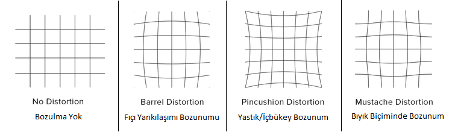


**Barrel Distortion:** Fıçı yaklaşımı bozulması veya varil distorsiyonu olarak adlandırılan bu bozulma şekline en çok balık gözü (fisheye) lenslerde raslanır, aşağıdaki görüntüde de görebileceğiniz üzere yaklaştırma efekti uygulanmışcasına nesneler merkeze doğru yaklaştıkça büyürken kenarlara doğru küçülürler.

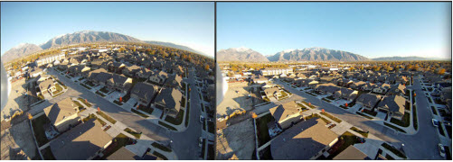

**Pincushion Distortion:** Yastık veya içbükey bozulma olarak adlandırılan bu bozulma şeklinde, merkezden kenarara doğru gidildikçe düz çizgiler iç bükey hale gelir böylelikle bu çizgiler yastık şekli oluşturur.

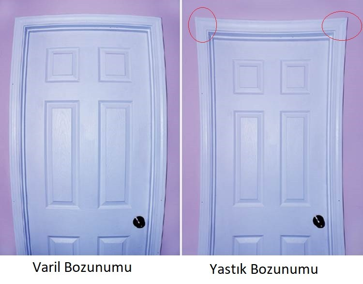

**Mustache Distortion:** Bıyık şeklinde bozulma olarak adlandırılan bu bozulmada, çizgiler merkezden köşelere doğru “Gidon Bıyık” şekline benzer bir eğri biçimindedir. Görüntü üzerinde bu bozulmayı çoğu zaman tespit edemeyebilirsiniz. Bu durumun çözümü için genellikle lens değişimi gerekir. Aşağıdaki resimde raylara ve iki duvarın kesişim noktasına bakarsanız bu bozulmayı çok net görebilirsiniz.

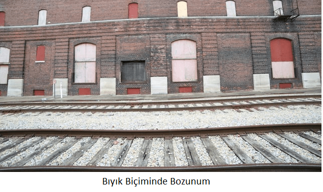


**Kamera Kalibrasyonu**

Kamera kalibrasyonu görüntü bozukluğunu düzeltmek için gerekli bazı verilere ulaşmak için yapılır. Kamera kalibrasyonu, bozuk görüntü kaynağı yani kamera üzerinde uygulanır ve bu kalibrasyon verileri kameraya özeldir yani hangi kameradaki görüntü düzeltmek isteniyorsa kalibrasyon işlemide o kamera üzerinde uygulanmalıdır.  Kalibrasyon işlemi ile aşağıdaki verilere ulaşırız;

Kamera Matrisi: Bozulma katsayılarının çıkış vektörü (k1, k2, k3, k4).
Kamera matrisi 3×3 boyutunda bir matristir genellikle “K” olarak da adlandırılır. Çıkış vektörü ise genellikle “D” olarak adlandırılır. OpenCV dökümanlarında bu değerlere “camera matrix” ve “dist coeff” denildiğinide görebilirsiniz.   Elde ettiğimiz bu veriler ile bozuk görüntüyü düzeltebiliriz. Şimdi bu verilere nasıl ulaşabileceğimize bakalım. Kamera kalibrasyonu için bir çok farklı algoritma geliştirilmiştir, bu algoritmalar referans noktaları kullanarak oluşan bozulmayı hesaplamaya çalışır. Bizde kalibrasyonu satranç tahtası ile gerçekleştireceğiz. OpenCV içerisinde gelen kalibrasyon modülü ile bizim için gerekli olan K ve D değerlerini elde etmeye çalışacağız.

**Kalibrasyon Süreci**

Öncelikle satır ve sütün sayısını bildiğimiz bir santraç tahtası görseline ihtiyacımız var, ben aşağıdakini kullanacağım sizde bunu tam boy olarak çıktı alıp kullanabilirsiniz, farklı ölçülerde bir desen kullanmak istiyorsanız kaynak kodda ilgili satır ve sütün alanını değiştirmelisiniz.

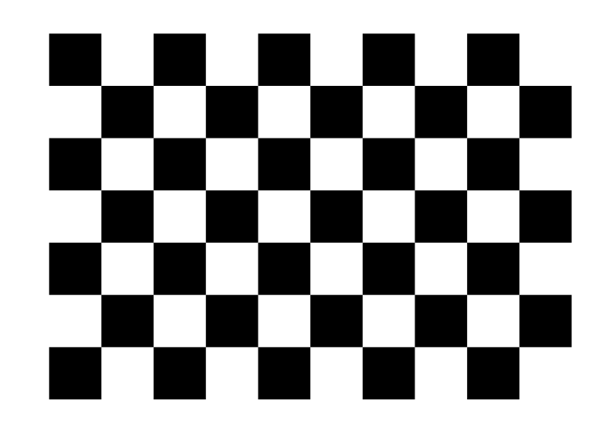

Kalibrasyon için bozulmaya neden olan kameranın karşısına (santraç deseninin tamamı görülebilecek şekilde) geçilir.  findChessboardCorners() metodu ile giriş olarak vereceğimiz görüntü üzerindeki köşeler hesaplanır. Eğer belirttiğimiz satır ve sütün sayısınca köşe doğru olarak tespit edilmişse cornerSubPix() metodu ile köşelerin veya radyal sırt noktalarının alt pikselinin, doğru konumunu bulmak için kendi içerisinde yineler. Elde ettiğimiz bu noktaları ve değerleri kalibrasyon verisi olarak saklayabiliriz. Bu kalibrasyon işlemini kendi belirleyeceğimiz bir iterasyon adeti boyunca tekrarlarız her tekrarlama periyodunda farklı bir açıdan alınmış görüntüyü kullanarak bu noktaların doğruluğunu sağlarız aksi taktirde kalibrasyon verisi yanlış olacak ve düzeltilmeye çalışılan görüntü daha kötü hale gelecektir.

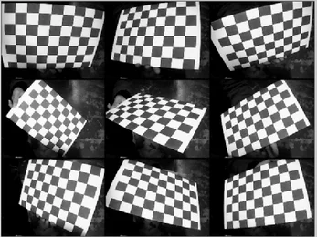


Kalibrasyon işlemi esnasında drawChessboardCorners() metodunu kullanarak tespit edilen noktaları görüntü üzerinde işaretleyebiliriz bu metot ile hangi frame için hesaplanan kalibrasyon verisinin işinize yarayıp yaramayacağına karar verebilirsiniz.  Bu metot aşağıdaki gibi bir çıktı verecektir.

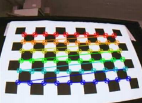


Görüntü Düzeltme
Kalibrasyon ile elde ettiğimiz K ve D verileri ve OpenCV undistort* metotlarını kullanarak bozuk görüntüyü düzeltebiliriz. Bu metotlar parametre olarak K ve D verilerine ihtiyaç duyar, sonuç olarak ise size düzeltilmiş görüntü dönecektir.

*Python:*

```Python
import cv2
import numpy as np

# Santraç tahtasının satır ve sütün sayısı 
rows = 9
cols = 6

# Kendi içerisinde yinelemeli olarak çalışan algoritmalar için durdurma/karar verme ölçütü
criteria = (cv2.TERM_CRITERIA_MAX_ITER + cv2.TERM_CRITERIA_EPS, 30, 0.001)

# İhtiyaç duyacağımız değişkenler
objectPoints = np.zeros((rows * cols, 3), np.float32)
objectPoints[:, :2] = np.mgrid[0:rows, 0:cols].T.reshape(-1, 2)
objectPointsArray = []
imgPointsArray = []

capture = cv2.VideoCapture(0) # Varsayılan kameraya bağlanır
found = 0 
# 10 defa başarılı kalibrasyon yapılana kadar tekrarlansın
while(found < 10):
    # Kameradan bir frame alıp bunu gri renk uzayına çevirir
    retCam,img = capture.read()
    gray = cv2.cvtColor(img, cv2.COLOR_BGR2GRAY)

    # Frame içerisindeki santraç tahtasının köşelerini bul 
    isSucces, corners = cv2.findChessboardCorners(gray, (rows, cols), None)

    # Köşeler bulunabildi mi?
    if isSucces:
        '''
        Eğer belirttiğimiz satır ve sütün sayısınca köşe doğru olarak tespit edilmişse 
        cornerSubPix() metodu ile köşelerin veya radyal sırt noktalarının alt pikselinin, 
        doğru konumunu bulmak için kendi içerisinde yineler.
        '''
        corners = cv2.cornerSubPix(gray, corners, (11, 11), (-1, -1), criteria)
        # Elde ettiğimiz bu noktaları saklayalım
        objectPointsArray.append(objectPoints)
        imgPointsArray.append(corners)

        # Testip edilen köşeleri çizelim
        cv2.drawChessboardCorners(img, (rows, cols), corners, isSucces)
        found += 1
    
    
    cv2.imshow('Kalibrasyon', img)
    cv2.waitKey(500)
cv2.destroyAllWindows()
# Elde ettiğimiz K ve D değerlerini npz arşivi olarak kaydedelim (txt, xml, yaml da kullanabilirsiniz)
ret, mtx, dist, rvecs, tvecs = cv2.calibrateCamera(objectPointsArray, imgPointsArray, gray.shape[::-1], None, None)
np.savez('calibrationdata.npz', mtx=mtx, dist=dist, rvecs=rvecs, tvecs=tvecs)


# Kalibrasyon verilerini kullanarak görüntüyü düzeltelim
cap = cv2.VideoCapture(0)
while True:
    # Gri renk uzayında frame okuyalım
    ret3,img = cap.read()
    h, w = img.shape[:2]
	
    '''
    Kalibrasyon ile elde ettiğimiz K ve D verileri ve OpenCV undistort* metotlarını kullanarak 
    bozuk görüntüyü düzeltebiliriz. Bu metotlar parametre olarak K ve D verilerine ihtiyaç duyar, 
    sonuç olarak ise size düzeltilmiş görüntü dönecektir.
    '''
    newCameraMtx, roi = cv2.getOptimalNewCameraMatrix(mtx, dist, (w, h), 1, (w, h))
    undistortedImg = cv2.undistort(img, mtx, dist, None, newCameraMtx)
	
    cv2.imshow('Duzeltilmis Goruntu', undistortedImg)
    cv2.waitKey(0)
    
cv2.destroyAllWindows()
```


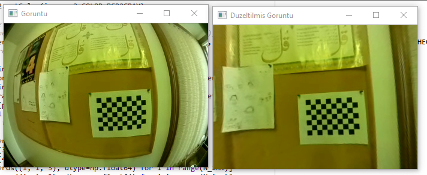


## Stereo Görü (Stereo Vision veya Stereoscopic Vision)

Stereo görü insanlanrın sahip olduğu bir yetenekten yola çıkarak uyarlanmış bir kavram/teknolojidir. Mono bir fotoğraf düşününü cep telefonlarınızla çektiğiniz gibi. Fotoğrafa baktığınızda karede yer alan nesnelerin hangisini önce hangisinin arkada olduğunu ayırt edebiliyorsunuz değil mi. Bu derinlik kestirimi olarak adlandırılır. Derinlik kestirimi yeteneğimiz yani iki gözümüz olmasaydı, beynimiz bu derinlik algısını doğru hesaplayamazdı. Bir gözünüzü kapattığınızda önünüzde duran bir nesnenin bir noktasına dokunmaya çalışın bunu daha iyi anlayacaksınız.

|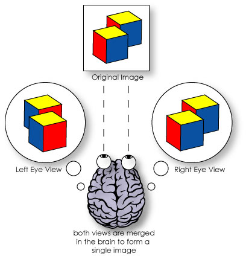 | 
|:--:| 
|*Görsel Kaynağı: Howstuffworks*|


Bilgisayarlı görü alanında da bir nesnenin kameraya olan mesafesini veya sahnedeki tüm herşeyin kameraya olan mesafesini hesaplayabilmek için bu teknolojiden yararlanılmaktadır. Bunun için OpenCV içerisinde bir çok algoritma hali hazırda kullanılabilir durumdadır, tek yapmanız gereken bir stereo kamera kullanmak veya stereo kamera düzeneği kurmak. Aşağıda örnek stereo kameralar görülebilir.


|<div style="width:50%; height:50%">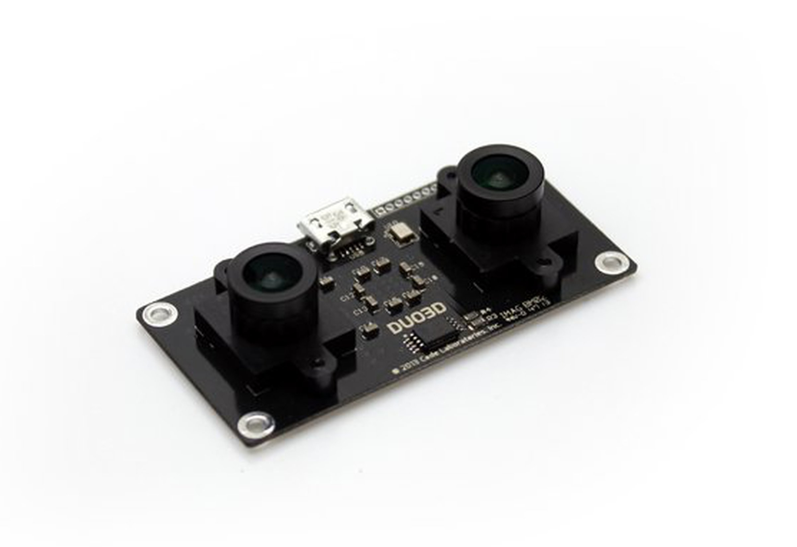 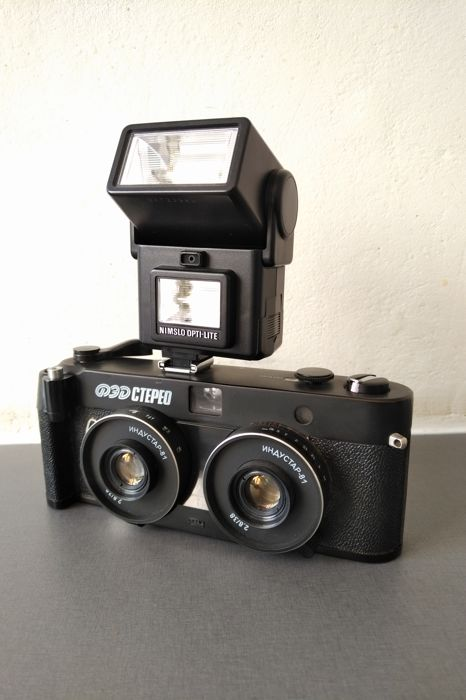 </div>| 
|:--:| 
|*Farklı stereo kameralar*|


**Derinlik Nasıl Hesaplanır?**


Aşağıdaki görselde bir stereo kamera düzeneği ve belirli bir mesafadeki nesne resmedilmiştir. **O ve O^**  sol ve sağ kameraları,  **X** ise belirli bir noktadaki nesneyi, **X ve X^** nesnenin sol ve sağ kameralarına olan iz düşümlerini, **f** ise kameraların odak uzaklığını, **B** ise iki kamera merceğinin birbirlerine olan mesafeini, **Z** ise kameranın nesneye olan uzaklığını yani derinlik bilgisini temsil etmektedir. Bu değişkenlerden; f yani odak uzaklığı, B yani mercekler arası mesafe önceden bilinen değişkenlerdir. Bu değişkenlere göre;


*Z = (f * B) / d*

Bilinmeyen **d** değişkeni görüntü düzlemine düşen iz düşümlerin bir birlerine olan mesafesidir. Buna göre;

*d (disparity) = X - X^ = (B * f) / Z*

Bu denklemler sayesinde hedeflediğimiz derinlik bilgisini çıkartabiliriz.