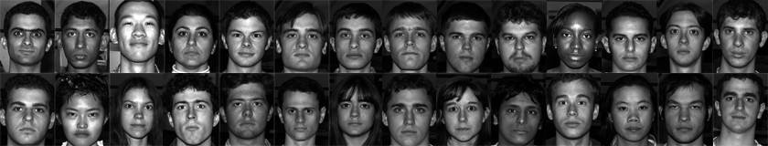

**Yüz Tanıma** 
--------------

Yüz tanımaya girmeden önce değinmemiz gereken bir konu var. Görüntü işlemede yüz tespiti için bir çok yöntem mevcut bu yöntemlere dahaönce gerek video eğitimlerimde gerekse yazılarımda değinmiştim. Yüz tanıma içinde farklı yöntemler mevcut, burada dikkat edilmesi gerekenkonu yüz tanıma işlemi ile yüz tespit işleminin farklı olmalı. Bazı yöntemler ile  görüntülerdeki insan yüzlerini diğer nesnelerden ayırtederek tespit edebiliriz çünkü insan yüzü geometrik olarak çok fazla farklılık göstermez bu farklılığın az oluşuda yüzü tespit etmeyikolaylaştırır. Yüz tanıma ise daha önceden tespit edilen bir kaynak yüzün, yeni alınacak yüz ile karşılaştırılıp aradaki benzerliğitespit edebilmekir. Bu bağlamda yüz tanıma tespit etme işlemine göre daha zordur. Ortamdaki ışık veya yüzde meydana gelecek küçükdeğişiklikler algoritmanızın hatalı sonuç vermesine yol açabilir. Bu durumlardan dolayı tespit ile tanıma işlemini bir birinden iyi ayırtetmek gerekir.

Yüz tanıma insanlar için oldukça kolay bir iştir. Bazı deneyler göstermiştir ki üç günlük bir bebek bile gördüğü yüzü daha sonra ayırt edebilmektedir. Peki, bilgisayarlar için bu durum ne kadar zor olabilir? Bizler bu güne kadar yüz tanıma konusunda çok az şey biliyorduk. Yüz tanıma esnasında gözleri, burnu, ağzı veya kafa şeklini, saçlarımızı kullanıyor muyduk? Beynimiz bunları nasıl analiz ediyor, nasıl kodlanmış olabilir ki? David Hubel ve Torsten Wiesel bize göstermiştir ki beynimiz çizgileri, kenarları, hareketleri, görüntünün belirli özelliklerini belirli sinir hücreleri ile anlayabiliyoruz. Bütün bir görseli parçalayarak veya parçalanmış bir görseli kullanarak oluşturulabilecek bir bütünden anlamlı sonuçlar çıkartabiliyoruz. Yüz tanıma ise bütün bir görüntüden anlamlı özelliklerin ayıklanması ve onların sınıflandırılarak karşılaştırılması ile oluyor.

Bir yüzün geometrik özelliklerine göre yapılacak yüz tanıma işlemi, muhtemelen yüz tanıma için en kolay yaklaşımdır. İlk otomatik yüz tanıma sistemlerinden biri Kanade73: işaretleyici noktaları (gözler, kulaklar ve burun pozisyonu) özellik vektörü (noktaları arasındaki mesafe, bunlar arasındaki açı) oluşturmak için kullanıldı. Özellik vektörünü kullanarak yapılan tanımada kaynak ve referans görüntünün özellik vektörleri arasındaki Öklid mesafe hesaplanarak yaptı. Bu gibi bir yöntem başarılı oldu, doğası gereği parlaklık gibi değişikliklere karşı dayanıklıydı, ancak çok büyük bir dezavantajları davardı. Geometrik yüz tanıma yöntemi ile yapılan bir başka çalışma [Bru92]. A 22 boyutlu özellik vektörü kullandı ve büyük veri setleri üzerinde deneyler yaptı. Tek başına geometrik özelliklerin yüz tanıma için yeterli olmayacağı bu çalışma ile fark edilmiştir.

[TP91], Eigenfaces yöntemi, yüz tanıma için bütünsel bir yaklaşım aldı. Yüz görüntüsünün bir noktasından yüksek boyutlu görüntü alanı ve küçük boyutlu bir temsil alındı ve sınıflandırma kolay hale getirildi. Doğrusal diskriminant analizi ile bir sınıfa özel projeksiyon [BHK97] yöntemi olarak yüz tanımada uygulandı. Temel fikri, sınıflar arasında varyansı maksimize ederken, bir sınıf içinde varyansı en aza indirmekti.

OpenCV içerisinde yer alan bazı yüz tanıma yöntemleri;

* Eigenfaces
* Fisherfaces
* Local Binary Patterns Histograms LBPH

Bu yöntemler dışında daha yüksek doğruluk oranı sağlayan derin öğrenme yöntemleri de mevcuttur.