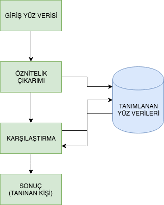
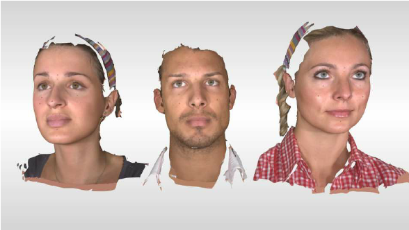

**Yüz Tanıma** 
--------------

Yüz tanımaya girmeden önce değinmemiz gereken bir konu var. Görüntü işlemede yüz tespiti için bir çok yöntem mevcut bu yöntemlere dahaönce gerek video eğitimlerimde gerekse yazılarımda değinmiştim. Yüz tanıma içinde farklı yöntemler mevcut, burada dikkat edilmesi gerekenkonu yüz tanıma işlemi ile yüz tespit işleminin farklı olmalı. Bazı yöntemler ile  görüntülerdeki insan yüzlerini diğer nesnelerden ayırtederek tespit edebiliriz çünkü insan yüzü geometrik olarak çok fazla farklılık göstermez bu farklılığın az oluşuda yüzü tespit etmeyikolaylaştırır. Yüz tanıma ise daha önceden tespit edilen bir kaynak yüzün, yeni alınacak yüz ile karşılaştırılıp aradaki benzerliğitespit edebilmekir. Bu bağlamda yüz tanıma tespit etme işlemine göre daha zordur. Ortamdaki ışık veya yüzde meydana gelecek küçükdeğişiklikler algoritmanızın hatalı sonuç vermesine yol açabilir. Bu durumlardan dolayı tespit ile tanıma işlemini bir birinden iyi ayırtetmek gerekir.

Yüz tanıma insanlar için oldukça kolay bir iştir. Bazı deneyler göstermiştir ki üç günlük bir bebek bile gördüğü yüzü daha sonra ayırt edebilmektedir. Peki, bilgisayarlar için bu durum ne kadar zor olabilir? Bizler bu güne kadar yüz tanıma konusunda çok az şey biliyorduk. Yüz tanıma esnasında gözleri, burnu, ağzı veya kafa şeklini, saçlarımızı kullanıyor muyduk? Beynimiz bunları nasıl analiz ediyor, nasıl kodlanmış olabilir ki? David Hubel ve Torsten Wiesel bize göstermiştir ki beynimiz çizgileri, kenarları, hareketleri, görüntünün belirli özelliklerini belirli sinir hücreleri ile anlayabiliyoruz. Bütün bir görseli parçalayarak veya parçalanmış bir görseli kullanarak oluşturulabilecek bir bütünden anlamlı sonuçlar çıkartabiliyoruz. Yüz tanıma ise bütün bir görüntüden anlamlı özelliklerin ayıklanması ve onların sınıflandırılarak karşılaştırılması ile oluyor.

Bir yüzün geometrik özelliklerine göre yapılacak yüz tanıma işlemi, muhtemelen yüz tanıma için en kolay yaklaşımdır. İlk otomatik yüz tanıma sistemlerinden biri Kanade73: işaretleyici noktaları (gözler, kulaklar ve burun pozisyonu) özellik vektörü (noktaları arasındaki mesafe, bunlar arasındaki açı) oluşturmak için kullanıldı. Özellik vektörünü kullanarak yapılan tanımada kaynak ve referans görüntünün özellik vektörleri arasındaki Öklid mesafe hesaplanarak yaptı. Bu gibi bir yöntem başarılı oldu, doğası gereği parlaklık gibi değişikliklere karşı dayanıklıydı, ancak çok büyük bir dezavantajları davardı. Geometrik yüz tanıma yöntemi ile yapılan bir başka çalışma [Bru92]. A 22 boyutlu özellik vektörü kullandı ve büyük veri setleri üzerinde deneyler yaptı. Tek başına geometrik özelliklerin yüz tanıma için yeterli olmayacağı bu çalışma ile fark edilmiştir.

[TP91], Eigenfaces yöntemi, yüz tanıma için bütünsel bir yaklaşım aldı. Yüz görüntüsünün bir noktasından yüksek boyutlu görüntü alanı ve küçük boyutlu bir temsil alındı ve sınıflandırma kolay hale getirildi. Doğrusal diskriminant analizi ile bir sınıfa özel projeksiyon [BHK97] yöntemi olarak yüz tanımada uygulandı. Temel fikri, sınıflar arasında varyansı maksimize ederken, bir sınıf içinde varyansı en aza indirmekti.

## Yüz Tanıma Algoritmaları

Yüz tanıma algoritmaları çalışma şekline göre 3 farlı başlık altında incelenebilir, farklı kaynaklarda 4 veya 5 başlık altında ele alındığını da görebilirsiniz.

 * Bütünsel Eşleme (Holistic Matching)
 * Öznitelik Tabanlı (Feature Based)
 * Hibrit Yaklaşım

**Bütünsel Eşleme (Holistic Matching)**

Bu yöntemde girdi olarak kullanılacak yüz verisi tek bir bütün parça halinde algoritmaya girdi verisi olarak sunulur. 2D (iki boyutlu) görüntüler üzerinde yüz tanıma için oldukça popüler bir yöntemdir. Opencv içerisinde de yer alan Eigenface bu yönteme bir örnektir.

**Öznitelik Tabanlı (Feature Based)**

Öznitelik tabanlı algoritmalar, öznitelik çıkarımı kullanarak yüzün önemli noktalarını referans alarak çalışır. Bu önemli noktalar göz, ağız, burun, yüz genişliği, ağız genişliği, alın genişliği veya göz bebekleri arası mesafe olabilir. Bu algoritmalar yüz tespiti için bilinen öz nitelikleri kullanır. Örneğin; Yüz burnun tam ortasından ikiye bölündüğünde oluşan iki parça neredeyse bir birinin simetriğidir, burun iki gözün altında yer alır, iki adet göz bulunur, burun ağız ile 2 gözün ortasındadır gibi bir çok temel öznitelikten ve bilinenden yararlanılır. OpenCV içerisinde yer alan ve nesne tanıma bölümünde işlenilen Haar-Cascade algoritması buna bir örnektir, bu algoritma ile görüntü içerisindeki yüzler tespit edilebilir, yine OpenCV içerisinde yeralan SIFT bu yönteme örnek gösterilebilir. İki boyutlu verileri için oldukça sık kullanılan bu yöntem üç boyutlu veriler içinde uygulanabilmektedir. Sinir Ağları ile yüz tanımayı da bu kategoride ele alabilirz.

**Hibrit Yaklaşım**

Hibrit algoritmalar adında anlaşılacağı üzere bütünsel eşleme ve öznitelik çıkarımını birlikte kullanarak daha iyi sonuçlar elde etmeyi amaçlar. Bazı uygulamalarda kamera karşısında gerçekten bir insan mı yoksa bir fotoğraf mı var bilmek istersiniz, Apple Face Id örneğinde olduğu gibi. Bu durumlarda yapmanız gereken en doğru yaklaşım, bir donanım ile (nokta bulut tarama yöntemi olabilir) yüzün üç boyutlu görüntüsünü çıkarmaktır, üç boyutlu görüntü üzerinde doğrudan bütünsel eşleme yaparak doğru yüz verisini elde etmeye çalışabilirsiniz ve ardından eşleştirme için öznitelik çıkarımını kullanabilirsiniz.

OpenCV içerisinde yer alan bazı yüz tanıma algoritmaları aşağıdaki gibidir;

* Eigenfaces
* Fisherfaces
* Local Binary Patterns Histograms LBPH

Bu algoritmaları denediğinizde hızlı fakat başarı oranı düşük sonuç alabilirsiniz, bu durumlarda daha yüksek doğruluk oranı sağlayan sinir ağı tabanlı sınıflandırma algoritmaları kullanılır.

Yüz tanıma algoritmaları veri seti içerisindeki en çok benzeyen yüzü bulmayı amaçlar. Bu yüzden girdi olarak, daha önce veri setiiçerisinde tanımlanmamış bir yüz verdiğinizde bile size benzeyen bir yüz bulabilir. Bu sorunun üstesinden gelmek için ise benzerlikoranları kullanılır. Genellikle 0-1 arasında olan bu benzerlik oranları ile bir eşik değeri belirlenir. Bu sayede belirli birbenzerlik oranını yakalayamayan eşleşemeler için sonuç üretmenin önüne geçilebilir.

**1.EigenFaces**
EigenFaces algoritması, eğitim için kullanılan tüm yüzler ile girdi olarak verilen yüzü karşılaştırır. Bu eşleştirme de eleme yöntemi kullanarak veri seti içerisindeki yüzler ile girdi yüzü arasında eşleşmeyen yerleri atarak sona kalan yüzü bulur.

**2.FisherFaces**
Fisherfaces algoritması, girdi olarak verilen yüz üzerindeki öznitelikleri belirler ve eğitim için kullanılan yüzler ile sırasıyla öznitelik yönünden karşılaştırır, en çok benzeyeni bulana kadar devam eder.

**3.Local Binary Patterns Histograms LBPH**
LBPH algoritması diğer algoritmalarda çok büyük bir sorun olan ışık ve çevre koşullarından en az oranda etkilenmeyi sağlamak amacıyla geliştirilmiştir. LBPH adından da anlaşılacağı üzere yerel pikselleri bir biriyle komşuluklarına göre inceleyerek sonuç çıkarmaya çalışır. Komşu piksel gruplarından yararlanarak yerel bir yapı bulmayı amaçlar, bu yöntemi girdi ve veri tabanındaki yüzler üzerinde uygulayarak en çok benzeyen yüzü bulmaya çalışır.

**4.Sinir Ağı ile Sınıflandırma**

Bu yöntemi kullanmak için çok fazla veriye ihtiyaç duyulur. Tanınmasını istenen kişilerin yüzleri sinir ağına eğitim verisi olarak girilir ve sinir ağı (genellikle CNN) verisetinde yer alan yüzler üzerinde baskın öz nitlikleri belirleyerek bir sınıflandırma yapar. Girdi olarak verilen yüz sinir ağına girdiğinde bakılması gereken öz nitelikler eğitim ile belirlendiği için hızlı bir şekilde yüzün hangi sınıta olduğu belirlenir. Veri tabanına eklenen her kişinin yüzü artık ayrı bir sınıf olmuştur geriye kalan ise girdi olarak verilen yüzün hangi sınıfta olduğudur.
