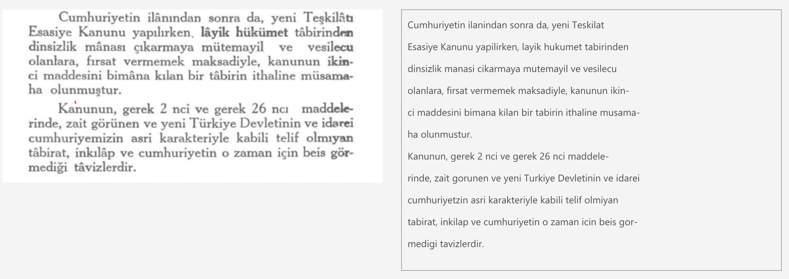

**OCR (Optical Character Recognition - Optik Karakter Tanıma)** 
---------------------------------------------------------------

Optik karakter tanıma; taranmış, fotoğraflanmış veya dijital olarak üretilmiş herhangi bir görüntü üzerinde yer alan metinlerin görüntü üzerinde tespit edilerek değiştirilebilir metin haline dönüştürülebilmesidir. OCR dijital olarak oluşturulmuş veya el yazısı ile yazılmış karakterleri tanıma yeteneğine sahiptir.



Algoritmaya göre bu aşamalar değişmekle birlikte OCR temel olarak üç aşamalı bir süreçtir;

1. Önişleme
2. Karakter Tespiti
3. Sınıflandırma

şimdi bu süreçlere bir göz atalım.

**1. Önişleme**

Görüntünün önişlenmesi; görüntü işlemenin ilgilendiği temelalanlardan bir tanesidir. Önişleme ile, görüntü üzerindeki gürültüler temizlenir, ışık dengesi yapılır, kırpma, boyutlandırma yapılır ve renk uzayı dönüşümleri gerçekleştirilebilir. Önişleme süreci kullanılan algoritmaya göre değiklik göstermekle birlikte bir çok algoritma için ise geliştirici tarafından önişlenmiş görüntünün girdi olarak verilmesi beklenir.

**2. Karakter Tespiti**

Bu bölümde görüntü üzerinde yer alan alfabatik karakterlerin tespit işlemi gerçekleştirilir. Görüntü üzerinde alfabatik karakterler dışında bir çok nesne yer alabilir, karakterler ile bu nesnelerin ayıklanması gerekmektedir bu işlemler karakter tespiti aşamasında gerçekleştirilir. Karakter tespiti aşamasında tespit edilen karakterlerin ne olduğu yani tanımlanması yapılmaz.

**3. Sınıflandırma**

Önişlenmiş ve karakter tespiti yapılmış görüntü üzerine karakterlerin ASCI karşılıklarının belirlenmesi sürecidir. Görüntü üzerinde yer alan metinler bir çok farklı fontla, farklı dille farklı şekilde yazılmış olabilir, bu da farklı veri setleri ile eğitilmiş bir sınıflandırıcı ihtiyacı doğurur. OCR algoritmasının başarı oranını etkileyen en önemli faktör buradaki sınıflandırıcının başarı oranıdır.


# Tesseract Kütüphanesi ile OCR

OCR için geliştirilmiş birçok kütüphane ve algoritma mevcuttur. Açık kaynak olarak geliştirilmiş ücretsiz en iyi kütüphanelerden birisi hiç şüphesiz ki **tesseract**'dır.


Tesseract 1985-1994 yılları arasında HP tarafından C++ ile geliştirilmiş bir kütüphanedir. 2006 yılından beri ise Google desteği ile geliştirilmeye devam etmektedir. En kararlı sürümü şuan için 4.0'dır. Tesseract UTF-8 desteğine sahiptir ve 100 den fazla dili desteklemektedir. 4. sürümü ile bilikte RNN(Recurrent Neural Network) çeşidi olan LTSM desteğine kavuşmuştur, bu sayede derin öğrenmeden yararlanarak daha iyi sonuçlar elde etmenize yardımcı olmaktadır.

# Kurulum

Python örneği için **pytesseract** kullanacağız, bunun için öncelikle bu python paketini kuralım.

```Bash
pip install pytesseract
```
Tesseract farklı dillerdeki metinleri tanıyabilmek için eksra bir modele ihtiyaç duyar, bu modeli aşağıdaki bağlantıdan indirebilirsiniz. 

- https://github.com/tesseract-ocr/tessdata

İsterseniz binary dosyaları işletim sisteminize doğrudan kurabilirsiniz. Bunun için buradaki bağlantı üzerinden işletim sistemine ve istediğiniz OCR diline göre özelleştirilmiş kurulum adımlarını izleyebilirsiniz. https://github.com/tesseract-ocr/tesseract/wiki

Örneğin MacOS için;

```Bash
brew install tesseract
```


# Örnek Proje

OpenCV ile bir görüntü yükleyelim ve bu görüntüyü tesseract ile metne çevirelim. Benim sistemimde İngilizce **tessdata** paketi olduğu için İngilizce seçtim, Türkçe için **lang = 'tur'** kullanabilirsiniz. Dil paketleri için [buraya](https://github.com/tesseract-ocr/tesseract/wiki/Data-Files) göz atabilirsiniz.

```Python
import cv2
import pytesseract


#OpenCV ile goruntuyu oku
frame = cv2.imread("metin.png");

#Matris goruntuyu tesseract ile metne çevir
print(pytesseract.image_to_string(frame, lang='eng'))
```

Yukarıdaki projeyi çalıştırdığınızda görüntü metne çevrilecektir. Daha detaylı kullanımlar için bu bölümün örnek projelerine göz atabilirsiniz.

---

### Teorik Temel — OCR Algoritmaları

**CTC (Connectionist Temporal Classification) Loss:**
Değişken uzunluklu çıktı dizilerini etiketlemek için:
$$p(l|x) = \sum_{\pi \in \mathcal{B}^{-1}(l)} p(\pi|x), \quad p(\pi|x) = \prod_{t=1}^T p(\pi_t|x)$$
$\mathcal{B}$: blank sembolü kaldırma ve tekrar azaltma operatörü. Hizalama etiketi gerektirmez.

**CRNN Mimarisi (CNN + RNN + CTC):**
1. CNN: görüntü öznitelikleri → özellik haritası
2. Sütun bazlı özellik vektörleri → sekans
3. Bidirectional LSTM: bağlamsal kodlama
4. CTC decoder: karakter olasılıkları → metin dizisi

Referans: Shi et al., "An End-to-End Trainable Neural Network for Image-based Sequence Recognition", IEEE TPAMI 2017 (https://arxiv.org/abs/1507.05717)

```python
import easyocr
import cv2
import numpy as np

# EasyOCR — Türkçe dahil 80+ dil
reader = easyocr.Reader(["tr", "en"], gpu=False)
results = reader.readtext("belge.jpg")

img = cv2.imread("belge.jpg")
if img is None:
    raise FileNotFoundError("belge.jpg bulunamadı")

for (bbox, text, confidence) in results:
    if confidence > 0.5:
        print(f"Metin: {text!r}, Güven: {confidence:.2f}")
        pts = np.array([[int(p[0]), int(p[1])] for p in bbox])
        cv2.polylines(img, [pts], True, (0, 255, 0), 2)

cv2.imshow("OCR Sonuçları", img)
cv2.waitKey(0)
cv2.destroyAllWindows()

# Tesseract ile Türkçe OCR
try:
    import pytesseract
    from PIL import Image

    img_pil = Image.open("belge.jpg")
    text = pytesseract.image_to_string(img_pil, lang="tur+eng")
    print("Tesseract çıktısı:")
    print(text)
except ImportError:
    print("pytesseract kurulu değil: pip install pytesseract")
```

### Özet & İleri Okuma
- CTC loss hizalama etiketi olmadan sekans çıktısı öğrenmesini sağlar
- CRNN (CNN+BiLSTM+CTC) metin tanımada temel mimari olmuştur
- EasyOCR 80+ dili destekler; kutu koordinatlarıyla birlikte metin döndürür
- Tesseract açık kaynak, Türkçe dahil çok dilli OCR sunar; tur.traineddata gerekir
- PaddleOCR ve TrOCR modern transformer tabanlı alternatifleridir
- Referans: Shi et al. 2017 (https://arxiv.org/abs/1507.05717)

---

## EasyOCR ile Metin Tanıma

EasyOCR, 80+ dil desteği ve derin öğrenme tabanlı mimarisi ile Tesseract'a güçlü bir alternatiftir. El yazısı ve zor fontlarda daha iyi sonuç verir.

```bash
pip install easyocr
```

```python
import easyocr
import cv2

# İlk çalıştırmada model dosyaları indirilir (~100MB)
reader = easyocr.Reader(['tr', 'en'], gpu=False)

img = cv2.imread("metin.png")
results = reader.readtext(img)

for (bbox, text, confidence) in results:
    print(f"Metin: '{text}' — Güven: {confidence:.2f}")

    # Tespit kutusunu çiz
    pts = [list(map(int, p)) for p in bbox]
    cv2.polylines(img, [pts], True, (0, 255, 0), 2)
    cv2.putText(img, text, tuple(pts[0]),
                cv2.FONT_HERSHEY_SIMPLEX, 0.7, (0, 0, 255), 2)

cv2.imshow("EasyOCR Sonuç", img)
cv2.waitKey(0)
```

Sadece metin listesi almak için:

```python
texts = reader.readtext("metin.png", detail=0)
print(" ".join(texts))
```

---

## PaddleOCR ile Metin Tanıma

PaddleOCR, Baidu tarafından geliştirilen ve endüstri uygulamalarında geniş çapta kullanılan yüksek performanslı bir OCR çerçevesidir. Metin tespiti, tanıma ve yönelim düzeltme aşamalarını tek bir pipeline'da sunar.

```bash
pip install paddlepaddle paddleocr
```

```python
from paddleocr import PaddleOCR
import cv2

ocr = PaddleOCR(use_angle_cls=True, lang='en')  # 'ch' Çince için

result = ocr.ocr("metin.png", cls=True)
for line in result[0]:
    bbox, (text, confidence) = line
    print(f"Metin: '{text}' — Güven: {confidence:.2f}")
```

**Görsel çıktı:**

```python
from paddleocr import draw_ocr
from PIL import Image

result = ocr.ocr("metin.png", cls=True)
image = Image.open("metin.png").convert('RGB')
boxes = [line[0] for line in result[0]]
txts = [line[1][0] for line in result[0]]
scores = [line[1][1] for line in result[0]]

drawn = draw_ocr(image, boxes, txts, scores)
Image.fromarray(drawn).save("paddleocr_sonuc.png")
```

---

## TrOCR ile El Yazısı Tanıma

TrOCR, Microsoft tarafından geliştirilen Transformer tabanlı bir OCR modelidir. Özellikle el yazısı tanımada son derece başarılıdır.

```bash
pip install transformers pillow torch
```

```python
from transformers import TrOCRProcessor, VisionEncoderDecoderModel
from PIL import Image
import torch

# El yazısı için eğitilmiş model
processor = TrOCRProcessor.from_pretrained("microsoft/trocr-base-handwritten")
model = VisionEncoderDecoderModel.from_pretrained("microsoft/trocr-base-handwritten")

image = Image.open("el_yazisi.png").convert("RGB")
pixel_values = processor(images=image, return_tensors="pt").pixel_values

with torch.no_grad():
    generated_ids = model.generate(pixel_values)

text = processor.batch_decode(generated_ids, skip_special_tokens=True)[0]
print(f"Tanınan metin: {text}")
```

Baskı metni için `"microsoft/trocr-base-printed"` modelini kullanın.

---

## OCR Kütüphane Karşılaştırması

| Kütüphane | Dil Desteği | El Yazısı | Hız | Kurulum |
|-----------|------------|---------|-----|---------|
| Tesseract | 100+ | Kısıtlı | ★★★ | ★★★★ |
| EasyOCR | 80+ | İyi | ★★★ | ★★★★★ |
| PaddleOCR | 80+ | İyi | ★★★★ | ★★★ |
| TrOCR | EN/ZH | Mükemmel | ★★ | ★★★ |

Genel amaçlı kullanım için **EasyOCR** ile başlamanız önerilir. Prodüksiyon uygulamalar için **PaddleOCR** daha uygun olabilir.
