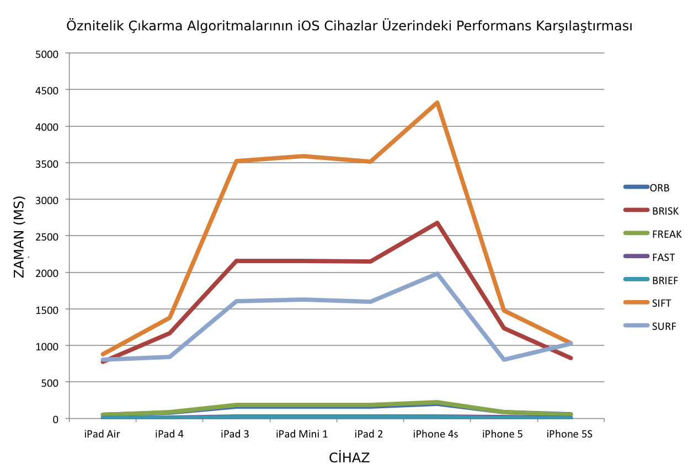

**Öznitelik ve Öznitelik Çıkarımı** 
-----------------------------------

Öznitelik bizim için en anlamlı tanım olarak  "bir nesnenin veya bireyin nitel özelliğidir", TÜBA Sözlüğe göre de "Bir sistemi, bir nesneyi veya bir sınıfı niteleyen, ayırt edilmesini sağlayan özellik" yani ayırt edici özelliktir. Bu tanımlardan yola çıkarsak nesneyi tanımlayan ve açıkca değiştirilmediği sürece nesneyi tanımlayan özelliklerdir yani bir canlı için cinsiyeti veya insan yüzünde burnun bulunması genel itibari ile o nesnenin bir üzelliğidir. 

## Öznitelik Çıkarımı (Feature Extraction)

Görüntü işleme, makine öğrenmesi, derin öğrenme, veri madenciliği ve örüntü tanıma uygulamalarında sıklıkla başvurulan bir yöntemdir. Bizim ilgilendiğimiz alanı ise görüntü üzerindeki nesnelerin ayırt edilebilmesidir. Bir çok algoritma tarafından kolayca çözülen bir problem olan yüz tespitini düşünün, siz olsaydanız bir insan yüzünü nasıl tanımlardınız?

 - İnsan yüzünde iki göz bulunur. 
 - İnsan yüzünde bir burun bulunur.
 - İnsan yüzünde bir ağız vardır.

 Peki ya göz, burun veya ağız nedir? Algoritmik olarak problemi ele aldığımızda insan yüzünü tanımlayan bir çok özellik ve bu özellikleri tanımlayan bir çok özellik vardır ve bunlar kendi içlerinde ayrı bir problem teşkil etmektedir. Bundan on beş veya yirmi yıl (neden yıllar önce olduğuna değineceğim) gibi bir süre önce bu problemi çözecek bir yazılım geliştirmeye çalışan birisi olduğunuzda bu süreç sizin için sancılı olacaktır. Çünkü nesnenin özniteliklerini tanımak ayrı bir mühendislik gerektirecekti. Gözün, burnun ve ağzın tüm özniteliklerini tanımlayan algoritmayı geliştirdikten sonra geriye kalan bunları birleştirmek olacak. Öznitelik çıkarımını başka amaçlar içinde kullanabilirsiniz. Örneğin nesneyi tespit etmek yerine aynı cins iki nesneyi bir biri ile karşılaştırmak/eşleştirmek **feature matching** için kullanabilirsiniz. Çünkü aynı cins iki nesne benzer öz niteliklere sahip olacaktır.

 ## OpenCV Uygulamaları

**Öznitelik Çıkarma (Feature Extraction)**

- SIFT
- SURF
- BRIEF
- ORB
- FAST
- BRISK

**Öznitelik Eşleştirme (Feature Matching)**

- Brute-Force
- FLANN

#### SIFT (Scale-Invariant Feature Transform - Ölçeklemeden Bağımsız Özellik Dönüşümü)

SIFT algoritması David  Lowe tarafından 1999 yılında duyruldu. Bu algoritma sayesinde karşılaştırılan iki farklı giriş nesnesinin boyutu/ölçeği değişse veya belirli bir eşik seviyesine kadar gürültülü bile olsa başarılı olarak öznitelikler çıkarılıp eşleştirilebilmektedir. SIFT 3D Modelleme, nesne tanıma, nesne eşleme, nesne takibi vb. gibi bir çok alanda kullanılan bir algoritmadır. SIFT algoritmasının çalışması dört aşamada incelenir. Bu aşamalar; "Scale-Space Extrema Detection",  "Keypoint Localization", "Orientation Assignment" ve "Keypoint Descriptor".

#### SURF (Speeded up Robust Features)

SIFT algoritmasını hızlandırmak amacıyla ortaya çıkan bu algoritma 2006 yılında Herbert Bay tarafından duyruldu. SIFT algoritmasına göre x2 x3 kat daha hızlı çalışan bu algoritma yine SIFT de olduğu gibi ölçeklemeden bağımsız çalışmaktadır. SURF algoritmasının çalışması üç aşamada incelenir. Bu aşamalar; "Interest point detection", "local neighborhood description" ve "matching".

Orjinal Görsel Kaynağı: http://www.willpowell.co.uk/blog/2014/09/07/feature-extractor-descriptor-performance-ios-ipad-iphones/

