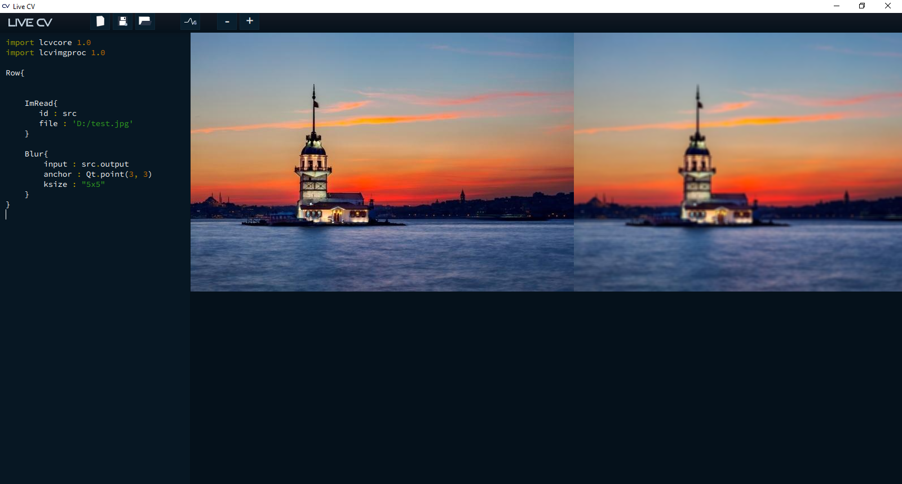
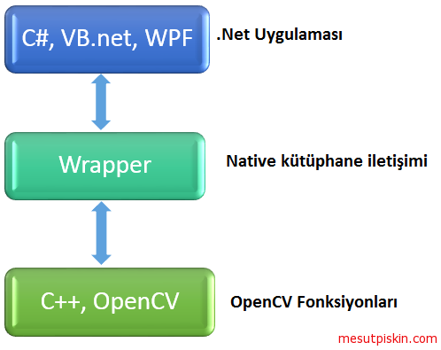

[Türkçe](./3-opencv-wrappers.md) | English

**OpenCV Wrappers** 
-------------------

**Wrapper:**

In its basic meaning, a wrapper is a container or envelope. We can define it as a software library developed commercially or as open source that references the OpenCV library, uses functions from within this library to develop its own functions, and makes them compatible with different platforms. As you know, OpenCV is open-source code and does not provide direct support for all programming languages. Notable among these unsupported languages are C#, Visual Basic .Net, F#, and Ruby. For languages that don't have direct support, wrappers have been created. Their primary purposes are to make the library usable for programming languages without direct support, to optimize existing functions to work better on a specific platform, or to simplify the library's usage by specializing it for a particular purpose. It's worth mentioning these libraries and looking at some of the wrappers that have been created.

*   **EmguCV:** This wrapper simplifies image processing application development under the .Net framework with C#, VB, VC++, Xamarin, IronPython, and Unity. It can run on Windows, Linux, Mac OS X, iOS, Android, and Windows Phone platforms. It's an actively maintained library with various licensing options. The official website is [http://emgu.com](http://emgu.com).
*   **JavaCV:** A wrapper developed for use within the Java technology framework. It references OpenCV libraries and supports application development in Java using C++ syntax. Many commonly used algorithms have been made more accessible. It uses not only OpenCV but also FFmpeg, libdc1394, PGR FlyCapture, OpenKinect, videoInput, ARToolKitPlus, and flandmark libraries. Developed as open-source code by Bytedeco and actively maintained with community support. It can be accessed at [https://github.com/bytedeco/javacv](https://github.com/bytedeco/javacv).
*   **OpenCVSharp:** Another library written for the .Net framework. It aims to enable image processing application development for .Net languages. Unlike EmguCV, it's open-source, so there's no additional license cost. It can be used for projects developed with .Net framework 2.0 and later, and with Mono support, applications can be developed for platforms like Linux and MacOS. Developed by Shimat and actively maintained, it can be accessed at [https://github.com/shimat/opencvsharp](https://github.com/shimat/opencvsharp).
*   **EHE-LAB OpenCV Wrapper:** An OpenCV wrapper developed for LabVIEW. Developed with reference to OpenCV version 2.4.9. It's a commercial product with a license fee of around $150. It runs on the Windows platform. Developed by EHE Lab, it has limited documentation but offers a free demo version. The official website is [https://www.ehe-lab.com](https://www.ehe-lab.com).
*   **Ruby-opencv:** A wrapper developed for Ruby. It's an open-source project. Developed with reference to OpenCV version 2.4.10 and supports Ruby 1.9.3 and 2.x. It's available for Linux, MacOS, and Windows platforms. Developed with community support, it can be accessed at [https://github.com/ruby-opencv/ruby-opencv](https://github.com/ruby-opencv/ruby-opencv).
*   **Live CV:** A wrapper that allows easy application development with the OpenCV library using QML.

***

**JavaCV**

Java developers face many challenges when developing OpenCV applications, especially on the Android platform. Examples and documentation explanations are typically provided in Python and C++, which is frustrating for Java developers. The absence of Java equivalents for some C++ functions makes matters worse. This is where JavaCV comes to the rescue.

#### What is JavaCV?

JavaCV is an OpenCV wrapper developed using JavaCPP. To briefly recap what a wrapper is: it's the transfer of a developed library from its source language or technology to the desired target language or technology to make it work on that platform. JavaCV is an image processing library developed for Java, referencing OpenCV but extended with many other libraries. It's not independent from OpenCV; rather, it develops in parallel in the same direction. Through many developed methods, it simplifies tasks and shortens development time. With the rise of Android, interest in the library has increased, and additional modules have been developed to make image processing even easier for this platform. Examples include Geometric Calibrator, ProCam Color Calibrator, Canvas Frame, GLCanvas Frame, and Parallel. With classes developed for hardware like Kinect, applications for these devices can be developed easily.

#### JavaCV or OpenCV?

First, I'd like to remind you that you can use both together in your project. I couldn't find a graph clearly showing the performance of these two libraries, so I prefer to explain based on experience. Comparing JavaCV and OpenCV is quite difficult because the answer to this question changes depending on what you'll use it for and your goal. If your goal is to develop applications for the Android platform or implement OpenCV C++ examples in Java projects, you can prefer JavaCV. If you want speed and performance in your developed project and are working with real-time operations, you can prefer the OpenCV library. These two libraries shouldn't be separated with sharp lines; the transferred functions and classes haven't been significantly altered, only additions have been made. For this reason, you can choose both libraries depending on the situation — not as competitors or alternatives, but as intermediate libraries that facilitate your work.

#### JavaCV Installation

JavaCV installation isn't much different from installing a normal Java library. You can download the project from the [Github link here](https://github.com/bytedeco/javacv) or download the current version 1.2 as a binary from [this link](http://search.maven.org/remotecontent?filepath=org/bytedeco/javacv/1.2/javacv-1.2-bin.zip).

When you extract the compressed file, you'll see many jar files inside. Add JavaCPP, JavaCV, OpenCV, and the opencv jar file suitable for your operating system to your project (opencv-windows-x86_64.jar for 64-bit Windows). You can download examples from [this link](https://github.com/bytedeco/javacv/tree/master/samples) and try them.

***

**Live CV**

LiveCV is an open-source development environment developed by [Dinu SV](http://dinusv.com/). I say development environment because it shouldn't be thought of as just another image processing library. Live CV is an OpenCV wrapper that allows development in a JSON-like structure using QML (Qt Meta Language or Qt Modeling Language). OpenCV functions can be used as JSON-format elements with QML. It provides a very useful environment for rapid prototyping, helping beginners understand OpenCV, or for academic work. Live CV comes with a development environment that has been designed quite simply and allows you to see the output of your code in real-time.

You can download the Live CV development environment from [here](http://livecv.dinusv.com/download.html) and access its GitHub repositories from [here](https://github.com/livecv/livecv). It's available for Windows, Linux, and MacOS platforms; for other platforms, you can download the source code and compile it. When you run Live CV, you'll be greeted with an IDE like the one shown below. On the left, we'll develop with QML; on the right, we can see the output of our code in real-time. For example, you can see a threshold applied to an image at the same moment — this applies not only to images but also to videos.

Let's do a simple example.

In OpenCV, the blur filter is used to blur an image. To apply it, the **blur()** method is used. This method takes as parameters the source image as a Mat object, a result as a Mat, and the blur value to be applied as a Size (also called kernel size). Usage is as follows:

```Java
Imgproc.blur(sourceImage, destImage, new Size(50,50));
```

```Python
cv2.GaussianBlur(image,(15,15),0)
```

When we want to do the same operation with Live CV, our QML code will be as follows:

```qml
import lcvcore 1.0
import lcvimgproc 1.0

Row{   
    ImRead{
       id : src
       file : 'D:/test.jpg'
    }
    
    Blur{
        input : src.output
        anchor : Qt.point(3, 3)
        ksize : "5x5"
    }
}
```

The reading of the image from the file system and the application of the filter are represented as a stream with elements. The result matrix with the same values will be exactly the same.



***

**OpenCV.JS**

One of the frequently encountered problems was how to use OpenCV functions in web applications. There have always been different solutions for this. As you know, the OpenCV library provides APIs for C/C++, Python, and Java programming languages. As the need for this popular library arose in web applications, the OpenCV.js library was released recently. This library is essentially an open-source project developed to enable OpenCV use in web applications, allowing you to develop computer vision applications with JavaScript. So far, in addition to basic OpenCV functions (OpenCV Core Package), approximately 800 functions/methods have been transferred to OpenCV.js, including machine learning algorithms, classification, segmentation, and many other functions you might need. OpenCV.js enables client-side image processing. OpenCV.js uses WebRTC for video processing, and asm.js or WebAssembly for functions, with Emscripten for compilation.

* * *

**Differences Between Wrappers (EmguCV) and OpenCV**

We mentioned earlier that EmguCV is an OpenCV wrapper. What are the differences with OpenCV, and whether we should use OpenCV or EmguCV in our projects? As you know, wrappers aim to make developed libraries work on or usable with the desired platform/technology/language. For this purpose, EmguCV developers take the functions, classes, and algorithms of the native OpenCV library, and develop a library that uses native libraries to make these functions work with .NET — a library that's the .Net equivalent. A function called or a class used by a .NET (C#, VB NET, etc.) developer first goes to EmguCV.dll, where the incoming request/function/class is processed and called via the corresponding OpenCV library. Requests and functions are not one-to-one the same; developers have made some changes due to platform/technology differences, both adding and removing to achieve usability for .NET. For these reasons, there may be performance differences between EmguCV and OpenCV depending on the algorithm called/used.



Theoretically, the lowest-level library will always run faster, but changes made for the platform can reverse this situation, making higher-level (EmguCV) libraries more performant in some special functions. If your project will be developed with .NET, it won't be possible to use OpenCV directly, so instead of asking whether to use OpenCV or EmguCV, it's more accurate to ask whether to use EmguCV or other .NET wrappers (OpenCVSharp, OpenCVDotNet, SharperCV, etc.). This question will also vary depending on whether you're looking for a paid or free source. If license costs aren't an issue, EmguCV is an excellent choice, but if you're looking for a free alternative, you should choose a current wrapper, otherwise you might be forced to use older algorithms in solving some problems since the wrapper uses older versions of OpenCV. Older or buggy algorithms are factors that directly impact performance. OpenCVSharp supports the current version OpenCV 3.1. Because of its Mono, .NET Framework 2.0, and later version support, it can be easily used for other platforms or legacy projects. With its well-prepared wiki and extensive example library, you can easily find many things you're looking for. It's developed for free under the BSD license as open-source code. OpenCVDotNet and SharperCV don't follow current OpenCV versions and are libraries that haven't received updates for a long time and whose development has nearly stopped. However, with their different approaches to functions, they can be used for basic image processing.
