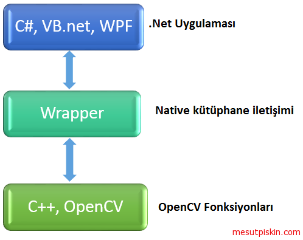

**OpenCV Wrappers** 
-------------------

**Wrapper:**
Türkçe kelime anlamı olarak sarıcı, sarmalayıcı manasına gelmektedir. Ticari yada açık kaynak olarak  geliştirilen, OpenCV kütüphanesini referans alan ve bu kütüphane içerisindeki fonksiyonları kullanarak kendi fonksiyonlarını geliştiren ve farklı platformlarla kullanılabilir hala getiren yazılım kütüphaneleri diyebilirz. Bildiğiniz üzere OpenCV açık kaynak kodlu bir yapıdadır ve tüm programlama dillerine doğrudan bir destek vermemektedir. Bu programlama dillerinden başlıcaları C#, Visaul Basic .Net, F# Ruby vb. dir. Doğrudan desteği olan programlama dilleri için de yazılmış wrapper’lar mevcuttur. Temel yazılış amaçları desteği olmayan programlama dilleri içinde bu kütüphaneyi kullanılabilir hale getirmek, olan fonksiyonları belirli bir platformda daha iyi çalışabilecek hale getirmek amacıyla optimize etmek veya bu kütüphanenin kullanımı kolaylaştırarak sadece belirli bir amaç için özelleştirmekdir. Bu kütüphanelerede değinmekte fayda olduğunu düşünüyorum ve yazılmış bazı wrapper’lara göz atalım.

*   **EmguCV:** Bu wrapper .Net framework çatısı altında bulunan C #, VB, VC++, Xamarin veya IronPython ve Unity ile görüntü işleme uygulamaları geliştirmeyi kolaylaştırmaktadır. Windows, Linux, Mac OS X, iOS, Android ve Windows Phone platformlarında çalışabilmektedir. Güncelliğini devam ettiren bir kütüphanedir ve farklı lisanslamalara sahipir. Resmi internet sitesi [http://emgu.com](http://emgu.com) . 
*   **JavaCV:** Java teknolojisi çatısı altında kullanmak için geliştirilmiş bir wrapper’dır. OpeCV kütüphanelerini referans alır ve java içerisinde C++ yazımında (syntax) uygulama geliştirmeyi destekler. Sıklıkla kullanılan bir çok algoritmayı kullanılabilirlik açısından kolaylaştırmışlardır. Sadece OpenCV değil FFmpeg, libdc1394, PGR FlyCapture, OpenKinect, videoInput, ARToolKitPlus, ve  flandmark gibi kütüphaneleride kullanmaktadır. Bytedeco tarafından açık kaynak kod olarak geliştirilmektedir ve güncelliğini devam ettiren bir kütüphanedir topluluk desteği bulunmaktadır. [https://github.com/bytedeco/javacv](https://github.com/bytedeco/javacv) adresi üzerinden ulaşılabilir durumdadır.
*   **Opencvsharp:** .Net framework için yazılmış bir başka kütüphanedir. .Net dilleri için görüntü işleme yazılımları geliştirebilmeyi amaçlamaktadır. EmguCV’den farklı olarak açık kaynak kodlu olduğu için eksra bir lisans maliyeti yoktur. .Net framework 2.0 ve üzeri ile geliştirilen projeler için kullanılabilir, mono desteği ile Linux ve MacOS gibi platformlar için de uygulama geliştirilebilir. Shimat tarafından geliştirilmektedir ve güncelliğini sürdüren bir kütüphanedir [https://github.com/shimat/opencvsharp](https://github.com/shimat/opencvsharp) adresi üzerinden ulaşılabilir durumdadır.
*   **EHE-LAB OpenCV Wrapper:** Labview için geliştirilmiş bir OpenCV wrapper’dır. OpenCV 2.4.9 sürümü referans alınarak geliştirilmiştir. Ticari bir üründür ve 150$ gibi bir lisans ücreti bulunmaktadır. Windows platformunda çalışmaktadır. Ehe lab tarafondan geliştirilmektedir, çok fazla dokümanı olmamakla birlikte demo sürümünü ücretsiz olarak indirip  Resmi websitesi [https://www.ehe-lab.com](https://www.ehe-lab.com) adresidir.
*   **Ruby-opencv:** Ruby için geliştirilmiş bir wrapper’dır. Açık kaynak kodlu yürütülen bir projedir. OpenCV 2.4.10 sürümü referans alınarak geliştirilmiştir ve Ruby 1.9.3, 2.x desteklemektedir. Linux, MacOS ve Windows platformu için kullanılabilmektedir. Topluluk desteği ile geliştirilmektedir, [https://github.com/ruby-opencv/ruby-opencv](https://github.com/ruby-opencv/ruby-opencv) adresinden ulaşılabilir durumdadır.
*   **Live CV:** QML ile kolay bir şekilde OpenCV kütüphanesi ile uygulamalar geliştirmenizi sağlayan bir wrapper. 

***
**JavaCV**


Java geliştiricileri OpenCV kütüphanesi ile uygulama geliştirken özelliklede Andorid platformu üzerinde bu işi yaparken bir çok zorluklarla karşılaşıyor. Örnekler veya dokümanlardaki anlatımlar Python ve C++ ile yapılıyor bu durum Java geliştiricileri için can sıkıcı bir durum, özellikle bazı C++ fonksiyonlarının Java karşılığının olmaması işleri daha da zora sokuyor. Bu durumda imdadınıza JavaCV yetişiyor.

#### JavaCV Nedir?

JavaCV, JavaCPP kullanılarak geliştirilmiş bir OpenCV wrapperıdır. Wrappar'ın ne olduğuna daha önce değinmiştik fakat kısaca tekrardan özetlememiz gerekirse; geliştirilen kütüphanenin, geliştirildiği kaynak dil, teknoloji referans alınarak istenilen hedef dil veya teknolojiye aktarılması bu platformda çalıştırılabilir hale getirilmesi denilebilir. JavaCV de OpenCV referans alınarak geliştirilmiş fakat üzerine bir çok farklı kütüphaneler eklenerek genişletilmiş bir Java görüntü işleme kütüphanesidir. OpenCV den bağımsız değil, aksine paralel olarak aynı doğrultuda gelişim göstermektedir.  Geliştirilen bir çok metot sayesinde işleri kolaylaştırmakta ve geliştirme süresini kısaltmaktadır. Özellikle Android'in ivme kazanması ile kütüphaneye olan rağbet artmış ve bu platform için görüntü işlemeyi daha da kolay hale getirmek için ekstra modüller geliştirilmiştir. Örnek vermek gerekirse Geometric Calibrator, ProCam Color Calibrator, Canvas Frame,GLCanvas Frame, Parallel vb. olarak özetlenebilir. Kinect vb gibi donanımlar için geliştirilmiş sınıflar ile bu cihazlara yönelik uygulamalar kolaylıkla geliştirilebilir.

#### JavaCV mi? OpenCV mi ?

Öncelikle projenizde ikisini de birlikte kullanabileceğinizi hatırlatmak isterim. Bu iki kütüphanenin performansını açıkça ortaya koyan bir grafik bulamadım bu yüzden tecrübelerime dayanarak anlatmayı tercih ettim. JavaCV ile OpenCV yi karşılaştırmak oldukça zor çünkü ne için kullanacağınıza ve amacınıza göre bu sorunun cevabı değişebilir. Amacınız Android platformuna uygulama geliştirmek veya OpenCV'nin C++ örneklerini Java projelerine implemente etmek ise JavaCV'yi tercih edebilirsiniz. Geliştirdiğiniz projede hız ve performans istiyor, gerçek zamanlı işler ile uğraşıyorsanız OpenCV kütüphanesini tercih edebilirsiniz. Bu iki kütüphaneyi de keskin çizgilerle ayırmamak gerekiyor, aktarılan fonksiyonlar ve sınıflar çok fazla değiştirilmemiş üzerine eklemeler yapışmış durumdalar. Bu yüzden duruma göre iki kütüphaneyi de terci edebilirsiniz bir rakip, alternatif değil işinizi kolaylaştıran ara bir kütüphane olarak görebilirsiniz.

#### JavaCV Kurulumu

JavaCV kurulumu normal bir Java kütüphanesi kurmaktan çokta farklı değil. Projeyi [buradaki](https://github.com/bytedeco/javacv) Github bağlantısından indirebilir veya şuan ki en güncel sürümünü 1.2 yi binary olarak [bu bağlantıdan](http://search.maven.org/remotecontent?filepath=org/bytedeco/javacv/1.2/javacv-1.2-bin.zip) indirebilirsiniz.

Sıkıştırılmış dosyayı çıkarttığınızda içerisinde bir çok jar dosyası göreceksiniz, projenize JavaCPP, JavaCV, OpenCV ve kullanmış olduğunuz işletim sisteminize uygun opencv jar dosyasını projenize ekleyin (x64 windows için  opencv-windows-x86\_64.jar ). [Buradaki](https://github.com/bytedeco/javacv/tree/master/samples) bağlantıdan örnekleri indirip deneyebilirsiniz.

***

**Live CV**

LiveCV [Dinu SV](http://dinusv.com/) tarafından geliştirilen açık kaynak kod bir geliştirme ortamı. Geliştirme ortamı diyorum çünkü farklı bir görüntü işleme kütüphanesi olarak düşünülmemeli. Live CV QML (Qt Meta Language veya Qt Modeling Language) dili ile json benzeri bir yapıda geliştirme yapmayı sağlayan OpenCV wrapperı. QML ile json formatındaki elementler şeklinde OpenCV fonksiyonları kullanılabiliyor. Hızlı prototipleme, yeni başlayanlar için OpenCV'yi kavrama veya akademik çalışmalar için oldukça kullanışlı bir ortam sunuyor. Live CV bir geliştirme ortamı ile birlikte geliyor bu geliştirme ortamı oldukça basit şekilde tasarlanmış ve yazdığınız kodun aynı anda çıktısını da görmenize olanak veriyor.

Live CV geliştirme ortamını [buradan](http://livecv.dinusv.com/download.html) indirebilirsiniz, github depolarına ise [buradan](https://github.com/livecv/livecv) ulaşabilirsiniz. Windows, Linux ve MacOS platformları için çalıştırılabilir durumdadır, diğer platformlar için kaynak kodunu indirerek derleyebilirsiniz.  Live CV'yi çalıştırdığınızda aşağıdaki gibi bir IDE sizi karşılıyor olacak. Sol tarafta QML ile geliştirmelerimizi yapacağız sağ tarafta ise yazdığımız kodun anlık olarak çıktısını görebileceğiz. Örneğin görüntü üzerine uyguladığınız bir thresholdingi aynı t anında görebiliyorsunuz, sadece görseller için değil videolar içinde bu durum geçerlidir.

Basit bir örnek yapalım,

OpenCV de blur filtresi görüntüyü bulanıklaştırmak için kullanılır. Uygulamak için ise **blur()** metodu kullanılır. Bu metot parametre olarak kaynak görüntü mat nesnesi tipinde, mat tipinde bir sonuç ve Size tipinde uygulanacak olan bulanıklık değerini almaktadır.(çekirdek boyutu olarak da adlandırılır). Kullanımı ise aşağıdaki gibidir.

```Java
Imgproc.blur(kaynakGoruntu, hedefGoruntu, new Size(50,50));
```

```Python
cv2.GaussianBlur(image,(15,15),0)
```

Live CV ile aynı işlemi yapmak istediğimizde ise QML kodumuz aşağıdaki gibi olacaktır.

```qml
import lcvcore 1.0
import lcvimgproc 1.0

Row{   
    ImRead{
       id : src
       file : 'D:/test.jpg'
    }
    
    Blur{
        input : src.output
        anchor : Qt.point(3, 3)
        ksize : "5x5"
    }
}
```

Görüntünün dosya sisteminden okunması ve filtrenin uygulanması bir akış şeklinde elementler ile temsil edilmektedir. Aynı değerler ile tanımlanan fonksiyonda sonuç matrisi bire bir aynı olacaktır.


***

**OpenCV.JS**

Sık sık yaşanılan sorunlardan bir tanesi web uygulamalarında OpenCV işlevlerinden nasıl yararlanılabilceğiydi. Bunun farklı çözümleri her zaman vardı. Bildiğiniz üzere OpenCV kütüphanesi  C/C++, Python ve Java programlama dilleri için API sağlamaktadır. Bu popüler kütüphaneye  web uygulamaları içinde ihtiyaç duyulması neticesinde OpenCV.js kütüphanesi yakın bir zamanda release oldu. Bu kütüphane temel olarak web uygulamalarında OpenCV kullanabilmek amacıyla geliştirilmiş açık kaynak kodlu bir projedir, bu sayede JavaScrip ile bilgisayarlı görü uygulamaları geliştirebilirsiniz.  Şimdiye kadar temel OpenCV işlevlerinin (OpenCV Core Paketi) yanında yaklaşık olarak 800 adet fonksiyon/method OpenCV.js e taşınmış, bu fonksiyonlar içerisinde makine öğrenme algoritmaları, sınıflandırma, segmentasyon gibi öncelikli olarak ihtiyaç duyabileceğiniz bir çok işlev mevcut. OpenCV.js istemci taraflı (Client Side) görüntü işlemeye olanak tanımaktadır. OpenCV.js  video işleme için yine popüler bir proje olan WebRTC kullanmaktadır, bunun yanında fonksiyonlar için  asm.js veya WebAssembly kullanılmıştır derlemek için ise Emscripten.

* * *

**Wrapper’lar (EmguCV) ile OpenCV Arasındaki Farklar Nelerdir?**


EmguCV'nin bir OpenCV wrapper'ı olduğundan daha önce bahsetmiştik, peki OpenCV ile arasındaki farklar nelerdir, projelerinizde OpenCV mi yoksa EmguCV mi tercih etmeliyiz sorusunun cevabına bakalım. Bildiğiniz üzere wrapper'lar  geliştirilen kütüphaneyi referans alarak istenilen platform/teknoloji/dil için çalıştırılabilir/kullanılabilir yapmayı amaçlar. Bu amaç doğrultusunda EmguCV geliştiricileri native OpenCV kütüphanesinin fonksiyonlarını, sınıflarını ve algoritmalarını alırlar, bu fonksiyonları .NET ile çalıştırabilmek için native kütüphaneleri kullanan bir kütüphane yani .net karşılığı library project geliştirirler.  .NET (C#,VB NET vb.) geliştiricisi tarafından çağrılan bir fonksiyon veya kullanılan bir sınıf öncelikle EmguCV.dll'ine gider gelen/kullanılan istek/fonksiyon/sınıf  işlenir ve karşılığı olan OpenCV kütüphanesi üzerinden çağrılır. İstekler ve fonksiyonlar bire bir olarak aynı değildir geliştiriciler platform/teknoloji arası farklılıklardan dolayı bazı değişiklikler yapmışlar gerek ekleme gerekse çıkarma yaparak .NET için kullanılabilir olmayı amaçlamışlardır. Bu sebeplerden dolayı çağrılan/kullanılan algoritmaya göre EmguCV ve OpenCV arasında performans farklıkları olabilir. 



Teorik olarak bakıldığında her zaman en alt seviyedeki kütüphane daha hızlı çalışacaktır fakat platforma göre yapılan değişiklikler bu durumu tersine çevirerek bazı özel fonksiyonlarda yüksek seviye (EmguCV) kütüphaneleri daha performanslı kılmaktadır. Projeniz .NET ile geliştirilecekse doğrudan OpenCV kullanmanız mümkün olmayacaktır bu yüzden OpenCV mi EmguCV mi diye sormak yerine EmguCV mi yoksa diğer .NET wrapper'lar mı (Opencvsharp, OpenCVDotNet, SharperCV vb.)diye sormak daha doğru olacaktır. Bu soru da ücretlimi yoksa ücretsiz mi kaynak aradığınıza göre değişecektir. Lisans ücretleri sorun olmayacaksa EmguCV çok iyi bir seçim olacaktır fakat ücretsiz bir alternatif arıyorsanız güncel bir wrapper seçmelisiniz aksi taktirde elinizdeki wrapper OpenCV'nin eski versiyonlarını referans alarak geliştirildiği için bazı problemlerin çözümünde eski algoritmaları kullanmak zorunda kalabilirsiniz. Eski veya bir çok bug bulunan algoritmalar performansı doğrudan etkileyen faktörlerdir. Opencvsharp en güncel sürüm olan OpenCV 3.1 sürümünü desteklemektedir. Mono, .NET Framework 2.0 ve sonrası versiyonları desteklemesi sayesinde diğer platformlar veya eski projeler için rahatlıkla kullanılabilir. İyi hazırlanmış wiki'si ve geniş örnek kütüphanesi ile aradığınız bir çok şeyi kolayca bulabilirsiniz. Açık kaynak kod olarak BSD lisansı altında ücretsiz olarak geliştirilmektedir. OpenCVDotNet ve SharperCV güncel OpenCV versiyonlarını takip etmemekle birlikte uzun zamandır güncelleme gelmeyen ve geliştirilmesi neredeyse durdu denilebilecek kütüphanelerdir. Fakat fonksiyonlara getirdikleri farklı yaklaşımlarla temel görüntü işleme için kullanılabilirler. 