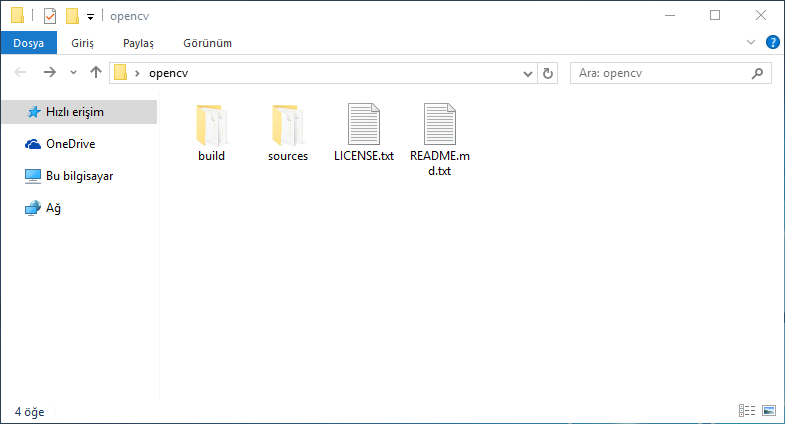
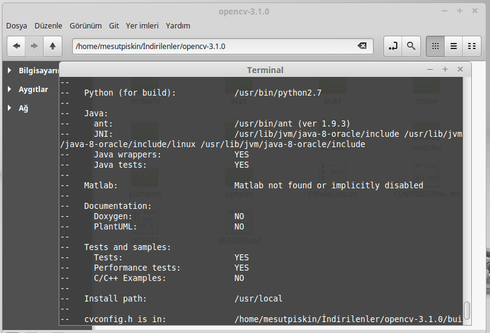
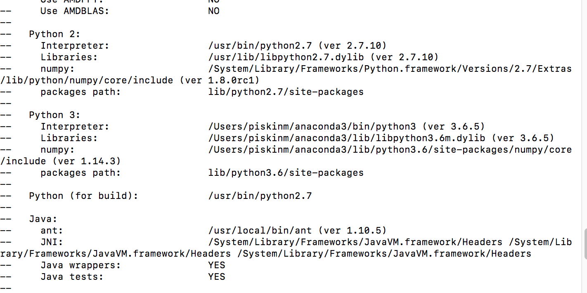

[Türkçe](./4-opencv-kurulumlar.md) | English

**OpenCV Installation and Compilation** 
-----------------------------

If you're developing with the Python programming language, you probably won't need to compile OpenCV. However, if you're developing on Linux or Unix distributions, you'll need to compile regardless of the platform.

For the Python programming language, you can install the latest version via pip as follows:

```Shell
pip install opencv-python
```

Or if you want to install with conda:

```Shell
conda install -c conda-forge opencv
```

If you're developing with Java or C++ programming languages, you can download pre-built binaries for Windows and use them. For other operating systems, you'll compile the source code with cmake.

**Windows**

For the Windows operating system, OpenCV is provided pre-compiled and ready to use as a system library. This means you don't need to recompile the source code. Go to http://opencv.org/downloads.html and click the OpenCV for Windows link under the version you want to download. The download link will redirect to the sourceforge site and the download will begin.

When you download, it will be compressed. When you run it, it will ask you for a directory to extract the OpenCV files. Enter the path where you want to extract the files and click the Extract button. In the OpenCV folder where you extracted the files, you'll find 2 folders: build and sources. Inside the build folder are the compiled Windows platform libraries and dependencies for programming languages — the OpenCV library itself. The sources folder contains OpenCV source code and sample applications. You can recompile OpenCV using the source code here. To develop an OpenCV application with Java, you can use the jar file in the java folder inside build, and you'll use the OpenCV Windows system libraries based on your operating system architecture.



**Linux**

For the Linux operating system, the OpenCV library must be compiled from source code. The basic reason is that there are many Linux distributions. The general idea is to allow users to compile according to their own system and the programming language they want to use. I'll explain the compilation process using Debian; for other distributions, there aren't many differences. If you have a Linux distribution other than Debian and its derivatives, the commands may vary according to your package manager, but there are one-to-one equivalents.

To install OpenCV, first go to http://opencv.org/downloads.html and click the OpenCV for Linux/Mac link under the version you want to use and download the source code from Itseez's GitHub account (the OpenCV developer). Note that there are no separate download links for Linux and Mac platforms. Since we said OpenCV is developed platform-independently with C and C++, you can download the source code and compile it on the platform you want to use.

When the download is complete, you'll get a zip file containing OpenCV source code. Extract this compressed zip file to a directory. We'll compile the source code in this directory. We'll use the cmake tool for compilation. Cmake is a platform-independent compilation tool with many compilers and can produce output according to that compiler. If Cmake isn't in your Linux distribution's repository, you can download and install it from https://cmake.org/download/.

```Shell
sudo apt-get install git
sudo apt-get install cmake
git clone https://github.com/opencv/opencv.git
cd opencv
```

For Java, let's install JDK and ANT on the system. For other languages that don't use the JVM, you don't need this and can skip this step.

```Shell
sudo add-apt-repository ppa:webupd8team/java 
sudo apt-get update 
sudo apt-get install oracle-java8-installer 
sudo apt-get install oracle-java8-set-default
sudo apt-get install ant
export JAVA_HOME=/usr/lib/jvm/java-8-oracle
```

Some OpenCV dependencies need to be installed on Linux:

```Shell
sudo apt-get install g++ libgtk2.0-dev pkg-config libavcodec-dev libavformat-dev libswscale-dev build-essential
```

After downloading and installing the required tools, we can proceed with compilation. As the first step, go to the folder where we extracted OpenCV from the zip file and follow the steps in order:

```Shell
mkdir build
cd build
cmake -DBUILD_SHARED_LIBS=OFF ..
```

After this command, cmake will create some files in the build folder and show output for operations to be performed before compilation begins. The important thing to note here is the Java section. If "NO" appears next to ant and JNI directories under the java heading, don't start the compilation as it won't create the jar file and system library. This is because ant or JDK installations are incomplete or the Java path hasn't been set. Repeat the steps above. If you see file directories like the one below under the Java heading, you can proceed with compilation.



If you encounter an error, you can check the error log file in build/makefiles. We'll start the compilation process with the make command. This process varies depending on your system's hardware. With the make –j command, you can speed up this process by dividing the compilation into different threads. For example, if you compile with make –j4, the total operation is divided into 4, running as 4 separate tasks. If you get a Process Kill error during compilation with make –j, compile using only the make command.

```Shell
make –j4
``` 

We start the compilation process with the command above. After the compilation process, there will be a jar file in build/bin with a name like opencv-3.jar (the name changes depending on the version you installed). Also in the build/lib directory, there will be a native library file like linopencv_java3.so (the name differs depending on the installed version). We'll use this jar file and library to develop applications.

**MacOS**

On macOS, you can install without compiling using brew. If you don't have HomeBrew installed on your system:

```Shell
/usr/bin/ruby -e "$(curl -fsSL https://raw.githubusercontent.com/Homebrew/install/master/install)"
``` 

For OpenCV:

```Shell
brew install python python3
brew link python
brew link python3
brew postinstall python3
pip3 install virtualenv virtualenvwrapper
brew install ant

export VIRTUALENVWRAPPER_PYTHON=/usr/local/bin/python3
export WORKON_HOME=$HOME/.virtualenvsexport PROJECT_HOME=$HOME/Develsource /usr/local/bin/virtualenvwrapper.sh

brew install opencv
``` 

If you want to compile it yourself:

```Shell
git clone https://github.com/opencv/opencv.git
cd opencv

brew install ant
brew install cmake

cmake -DBUILD_opencv_videoio=OFF
make
```



It's important to get the following output after the first command; here you should note when Java is "YES". After the operation, so files will be in the lib directory and jar in the bin directory.

**Raspbian (Raspberry Pi)**

```Shell
sudo apt-get update
sudo apt-get upgrade

sudo apt-get install oracle-java8-jdk
sudo apt-get install ant
sudo apt-get install build-essential
sudo apt-get install cmake
sudo apt-get install python-dev python-numpy
sudo apt-get install python-scipy python-matplotlib libgtk2.0-dev
sudo apt-get install libavcodec-dev libavformat-dev libswscale-dev
sudo apt-get install libjpeg-dev libpng-dev libtiff-dev libjasper-dev

nano ~/.bashrc
```

And add the following path definitions to the last line, save and close:

```Shell
export ANT_HOME=/usr/share/ant/
export PATH=${PATH}:${ANT_HOME}/bin
export JAVA_HOME=/usr/lib/jvm/jdk-8-oracle-arm32-vfp-hflt/
export PATH=$PATH:$JAVA_HOME/bin
```

And restart Raspberry Pi:

```Shell
sudo reboot
```

```Shell
wget https://codeload.github.com/Itseez/opencv/zip/3.2.0
mv 3.2.0 opencv.zip
unzip opencv.zip
cd opencv-3.2.0/
mkdir build
cd build
```

And start compiling:

Start compiling with cmake:

```Shell
cmake -D CMAKE_BUILD_TYPE=RELEASE -D WITH_OPENCL=OFF -D BUILD_PERF_TESTS=OFF -DJAVA_INCLUDE_PATH=$JAVA_HOME/include -DJAVA_AWT_LIBRARY=$JAVA_HOME/jre/lib/amd64/libawt.so -DJAVA_JVM_LIBRARY=$JAVA_HOME/jre/lib/arm/server/libjvm.so cmake -DENABLE_PRECOMPILED_HEADERS=OFF ... -D CMAKE_INSTALL_PREFIX=/usr/local ..
make
install
```

When the process is complete, you can find the native library libopencv_java320.so in the build/lib directory and the jar package in the build/bin directory as opencv-320.jar.
