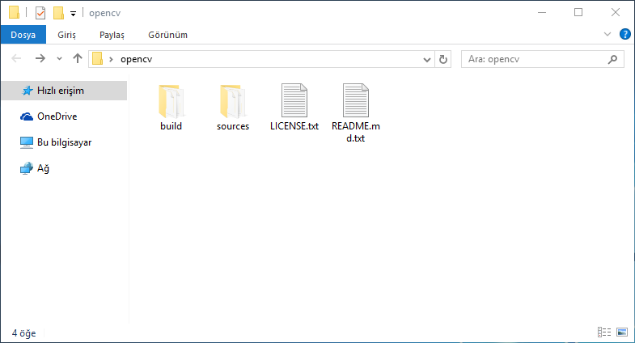
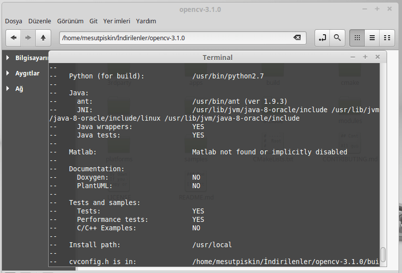
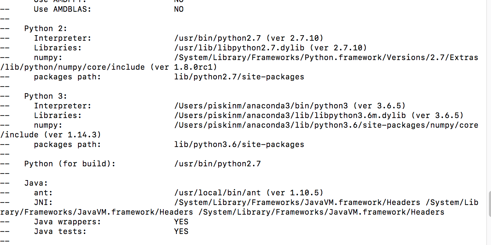

**OpenCV Kurulum ve Derleme** 
-----------------------------

Python programlama dili ile geliştirme yapıyorsanız OpenCV'yi derleme ihtiyacınız muhtemelen olmayacak, fakat Linux veya Unix dağıtımları üzerinde geliştirme yapıyorsanız platform bağımsız olarak derlemeye ihtiyac duyacaksınız.

Python programlama dili için pip üzerinden aşağıdaki şekilde güncel sürümünü kurabilirsiniz.

```Shell
pip install opencv-python
```

veya conda ile kurmak isterseniz;

```Shell
conda install -c conda-forge opencv
```

Java veya C++ programlama dili ile geliştirme yapıyorsanız, Windows için binary dosyaları indirip kullanabilirsiniz diğer işletim sistemleri için ise cmake ile kaynak kodu derleyerek başlayacağız.

**Windows**

Windows işletim sistemi için OpenCV derlenmiş, sistem kütüphanesi haline getirilmiş olarak bulunmaktadır. Bu sayede kaynak kodu tekrardan derlemeye ihtiyaç olmadan kullanılabilir haldedir. OpenCV’yi  http://opencv.org/downloads.html adresine giriyoruz ve indirmek istediğimiz sürümün altındaki OpenCV for Windows linkine tıklıyoruz. İndirme bağlantısı sourceforge sitesine yönlendirecek ve indirme işlemi başlayacak.

İndirdiğinizde sıkıştırılmış olarak gelecektir, çalıştırdığınızda OpenCV dosyalarını çıkartmak için bir dizin isteyecektir, burada çıkartılmasını istediğiniz dosya dizini yolunu yazarak Extract butonuna tıklayın. Dosyaları çıkarttığınız dizinde OpenCV klasörü içerisinde build ve sources diye 2 adet klasör bulunmaktadır. Build klasörü içerisinde Windows platformu için derlenmiş olarak sistem native kütüphaneler ve programlama dilleri için ise bağımlılıklar yani OpenCV kütüphanesinin kendisi bulunmaktadır.  Sources klasöründe ise OpenCV kaynak kodları ve örnek uygulamalar yer almaktadır. Buradaki kaynak kodlar ile OpenCV’yi tekrardan derleyebilirsiniz. Java ile OpenCV uygulaması geliştirmek için build içerisindeki java klasöründe yer alan jar dosyasını ve kullanabilirsiniz, işletim sistemi mimarisine göre OpenCV Windows sistem kütüphanelerini kullanacağız.



**Linux**

Linux işletim sistemi için OpenCV kütüphanesinin kaynak koddan derlenmesi gerekmektedir, bunun en temel sebebi birçok Linux dağıtımı olmasıdır. Temel olarak amaçlanan şey kullanmak isteyenin kendi sistemine ve kullanmak istediği programlama diline göre derlemesidir. Derleme işleminde Derleme işlemini Debian üzerinden anlatacağım, diğer dağıtımlar için ise çok fazla farklılık olmadığını belirteyim. Debian ve Debian çatallaması haricinde bir Linux dağıtıma sahipseniz, kullandığınız paket yöneticisine göre komutlar değişiklik gösterebilir, fakat bire bir olarak karşılıkları yer almaktadır.

OpenCV kurmak için öncelikle http://opencv.org/downloads.html adresinden kullanmak istediğiniz sürüm altında yer alan OpenCV for Linux/Mac bağlantısına tıklayarak OpenCV geliştiricisi olan Itseez’in Github hesabından kaynak kodları indiriyoruz. Dikkat ederseniz Linux ve Mac platformları için ayrı ayrı indirme bağlantısı bulunmamaktadır. OpenCV’nin C ve C++ dilleri ile platform bağımsız olarak geliştirildiği söylemiştik, bu sayede kaynak kodu indirerek istediğiniz platform üzerinde derleyerek çalıştırabilirsiniz.

İndirme işlemi tamamlandığında OpenCV’nin kaynak kodlarını içeren bir zip dosyası gelecektir. Bu zip formatında sıkıştırılmış dosyayı bir dizine çıkartınız. Bu dizinde kaynak kodun derlenmesi işlemini yapacağız. Derleme için cmake aracını kullanacağız. Cmake platform bağımsız bir derleme aracıdır, üzerinde birçok derleyici yer alır ve o derleyiciye göre çıktı üretebilmektedir. Cmake Linux dağıtımınızın deposunda yok ise https://cmake.org/download/ adresinden indirip kurabilirsiniz.

```Shell
sudo apt-get install git
sudo apt-get install cmake
git clone https://github.com/opencv/opencv.git
cd opencv
```

Java için sisteme JDK ve ANT kurulumu yapalım JVM kullanmayan diğer diller için buna ihtiyacınız olmayacak bu adımı atlayabilirsiniz.

```Shell
sudo add-apt-repository ppa:webupd8team/java 
sudo apt-get update 
sudo apt-get install oracle-java8-installer 
sudo apt-get install oracle-java8-set-default
sudo apt-get install ant
export JAVA_HOME=/usr/lib/jvm/java-8-oracle
```

Linux üzerinde bazı OpenCV bağımlılıklarını kurmak gerekmekte bunlar için

```Shell
sudo apt-get install g++ libgtk2.0-dev pkg-config libavcodec-dev libavformat-dev libswscale-dev build-essential
```

Gerekli araçları indirip kurduktan sonra artık derleme işlemine geçebiliriz. İlk adım olarak OpenCV’yi zip dosyasından çıkarttığımız klasöre gidiyoruz ve sırası ile aşağıdaki adımları takip ediyoruz.

```Shell
mkdir build
cd build
cmake -DBUILD_SHARED_LIBS=OFF ..
```

Bu komutun ardından cmake buil klasörü içerisine bazı dosyalar oluşturacak ve derlemeye başlamadan yapılacak olan işlemler için bir çıktı gösterecektir. Burada dikkat etmemiz gereken nokta java kısmı, eğer java başlığı altında ant ve JNI dizinleri karşısında NO ibaresi yer alıyor ise derleme işlemine başlamayınız, jar dosyasını ve sistem kütüphanesini oluşturmayacaktır. Bunun nedeni ant veya JDK kurulumlarının eksik veya java yolunun verilmemiş olmasıdır yukarıdaki adımları tekrardan yapınız. Eğer java başlığı altında aşağıdaki gibi dosya dizinleri görünüyor ise derleme işlemine geçebilirsiniz.



Hata ile karşılaşırsanız build/makefiles içerisinde yer alan error log dosyasına bakabilirsiniz. Derleme işlemini make komutu ile başlatacağız. Bu işlem sisteminizin donanıma göre değişiklik göstermektedir. make –j komutu ile derleme işlemini farklı threadlere bölerek bu süreyi hızlandırabilirsiniz, örneğin make –j4 ile derleme yaparsanız toplam işlemi 4 e bölerek, 4 ayrı iş parçası olarak çalıştırır. Eğer make –j ile derleme esnasında Process Kill hatası alırsanız sadece make komutunu kullanarak derleme işlemini yapın. Raspberry Pi gibi geliştirme kartları üzerinde OpenCV derleme işlemi yapacaksanız tamamlanma süresi biraz uzun olacaktır.


```Shell
make –j4
``` 

Komutu ile derleme işlemini başlatıyoruz. Derleme işleminin ardından build/bin içerisine opencv-3.jar gibi kurduğunuz sürüme göre ismi değişecek bir jar dosyası olacaktır.  Yine build/lib dizininde linopencv_java3.so (kurulan sürüme göre ismi farklılık gösterir) olarak native kütüphane dosyası olacaktır. Bu jar dosasını ve kütüphaneyi uygulama geliştirmek için kullanacağız.


**MacOS**

macOS üzerinde derleme yapmadan brew ile kurulumu yapabilirsiniz. Sisteminizde HomeBrew kurulu değil ise

```Shell
/usr/bin/ruby -e "$(curl -fsSL https://raw.githubusercontent.com/Homebrew/install/master/install)"
``` 

OpenCV için

```Shell
brew install python python3
brew link python
brew link python3
brew postinstall python3
pip3 install virtualenv virtualenvwrapper
brew install ant

export VIRTUALENVWRAPPER_PYTHON=/usr/local/bin/python3
export WORKON_HOME=$HOME/.virtualenvsexport PROJECT_HOME=$HOME/Develsource /usr/local/bin/virtualenvwrapper.sh


brew install opencv
``` 


Kendiniz derlemek isterseniz ise;
```Shell
git clone https://github.com/opencv/opencv.git
cd opencv

brew install ant
brew install cmake

cmake -DBUILD_opencv_videoio=OFF
make
```


Birinci komut sonrası aşağıdaki çıktıyı almanız önemli burada Java’nın “YES” olduğunda dikkat etmelisiniz. İşlem sonrası so dosyaları lib dizininde jar ise bin dizini içerisinde olacaktır.


**Raspbian (Raspberry Pi)**

```Shell
sudo apt-get update
sudo apt-get upgrade

sudo apt-get install oracle-java8-jdk
sudo apt-get install ant
sudo apt-get install build-essential
sudo apt-get install cmake
sudo apt-get install python-dev python-numpy
sudo apt-get install python-scipy python-matplotlib libgtk2.0-dev
sudo apt-get install libavcodec-dev libavformat-dev libswscale-dev
sudo apt-get install libjpeg-dev libpng-dev libtiff-dev libjasper-dev


nano ~/.bashrc
```

ve en alt satıra aşağıdaki yol tanımlarını ekleyerek kaydedin ve kapatın,

```Shell
export ANT_HOME=/usr/share/ant/
export PATH=${PATH}:${ANT_HOME}/bin
export JAVA_HOME=/usr/lib/jvm/jdk-8-oracle-arm32-vfp-hflt/
export PATH=$PATH:$JAVA_HOME/bin
```

ve Raspberry Pi’ı yeniden başlatalım,

```Shell
sudo reboot
```

```Shell
wget https://codeload.github.com/Itseez/opencv/zip/3.2.0
mv 3.2.0 opencv.zip
unzip opencv.zip
cd opencv-3.2.0/
mkdir build
cd build
```

ve derlemeye başlayalım

cmake ile derlemeye başlayalım

```Shell
cmake -D CMAKE_BUILD_TYPE=RELEASE -D WITH_OPENCL=OFF -D BUILD_PERF_TESTS=OFF -DJAVA_INCLUDE_PATH=$JAVA_HOME/include -DJAVA_AWT_LIBRARY=$JAVA_HOME/jre/lib/amd64/libawt.so -DJAVA_JVM_LIBRARY=$JAVA_HOME/jre/lib/arm/server/libjvm.so cmake -DENABLE_PRECOMPILED_HEADERS=OFF ... -D CMAKE_INSTALL_PREFIX=/usr/local ..
make
install
```

işlem tamamlandığında build/lib dizininde native kütüphaneyi yani  libopencv_java320.so dosyasını, build/bin altında da jar paketini bulabilirsiniz opencv-320.jar