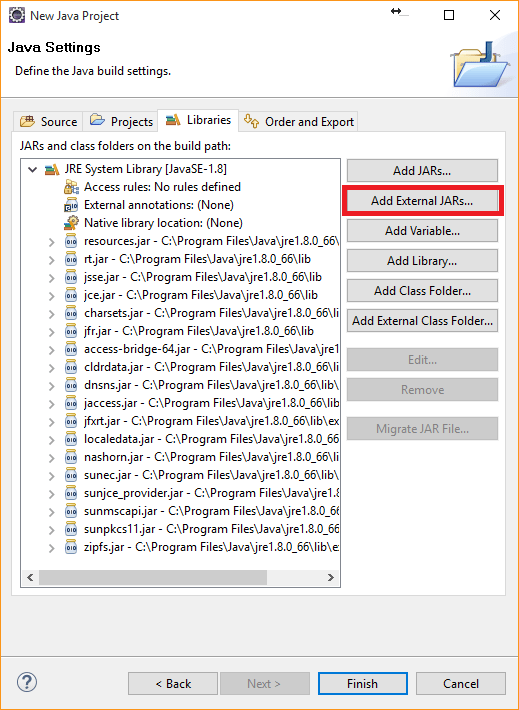
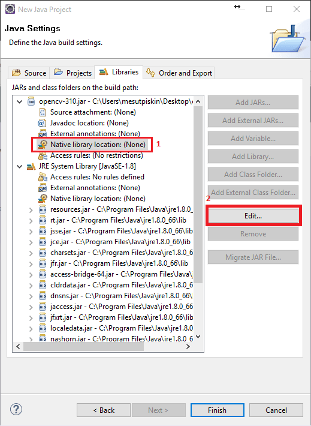
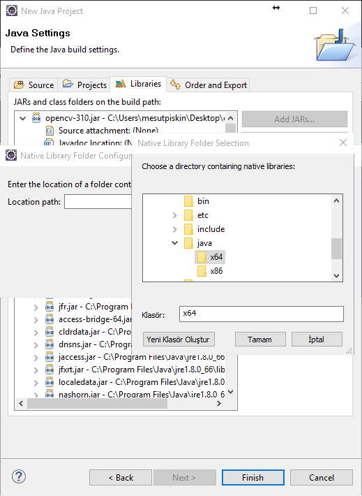
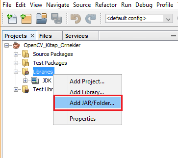
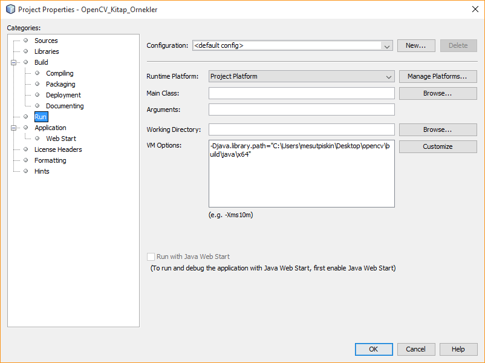

**Java için IDE Yapılandırması** 
--------------------------------

Java için farklı geliştirme ortamları mevcut olmasına rağmen Maven ile OpenCV'yi kullanabilirsiniz. Fakat OpenCV maven depoları üzerinde resmi olarka yer almıyor online inport etmek yerine pom.xml üzerinden file system olarak referans verebilirsiniz, bunun için:


pom.xml
```Shell
 <dependency>
      <groupId>opencv</groupId>
      <artifactId>opencv</artifactId>
      <version>3.42</version>
      <scope>system</scope>
      <systemPath>/myfolder/lib/opencv-342.jar</systemPath> 
    </dependency>
```
şeklinde projenize proje dizinindeki OpenCV jar dosyasını import ederek kullanabilirsiniz. Maven dependency olarak eklediğiniz JVM parametresi olarak native kütüphane dizinini belirtmeniz veya uygulama içerisinde yüklemeniz gerekir. Bunu aşmayı örnek projelerde göreceğiz.


**Eclipse**

Eclipse ücretsiz bir geliştirme ortamıdır. Eklenti desteği sayesinde esnek ve hızlıdır, java projelerinde en çok tercih edilen IDE dir. Eclipse Mars 1 sürümünü kullanacağım tercih ettiğiniz bir sürümü kullanabilirsiniz. Eclips’i https://eclipse.org/downloads/ adresinden Eclipse IDE for Java Developers veya Eclipse IDE for JavaEE Developers paketini kullandığınız işletim sistemine göre indirebilirsiniz. OpenCV kütüphanesini kullanabilmek için jar dosyasına ve sistem kütüphanesine ihtiyacımız var. Bu dosyalar Windows kullanıyorsanız daha önce indirdiğiniz OpenCV klasörü içerisindeki build\java dizininde jar dosyası ve işlemci mimarisine göre x86 ve x64 olarak sistem kütüphanesi bulunmaktadır. Linux ile OpenCV derleme işlemi yaptıysanız Opencv klasörü içerisinde build\bin dizininde jar dosyası, build\lib içerisinde ise sistem kütüphanesi yer almaktadır.


Eclipse ile yeni bir proje oluşturalım ve jar dosyasını kütüphanelere ekleyelim. Add External JARs butonu ile OpenCV jar dosyasını seçiyoruz. Bir user library oluşturup, jar dosyasını ve sistem kütüphanesini proje içerisine ekleyebilirsiniz.



OpenCV’nin bulunduğu dizinden jar dosyasını seçerek devam ediyoruz.



Bir sonraki aşamada işletim sistemine mimarisine göre sistem kütüphanesini,  jar dosyasına native library olarak eklememiz gerekmektedir. Windows kullanıyorsanız x64 ve x86 olarak işlemci mimarisine göre farklı kütüphaneler bulunmaktadır kullandığınız mimariye göre seçmeniz gerekmektedir. Linux kullanıyorsanız derleme işlemini kendi bilgisayarımızda yaptığımız için, kullanılan bilgisayar mimarisine göre derlemiştir bu yüzden so uzantılı kütüphaneyi lib klasöründen seçmeniz yeterli olacaktır.

Jar dosyasını seçtik ve library kısmına Opencv kütüphanesi geldi.  Native library location seçerek edit butonuna tıklıyoruz.



Açılan pencereden External Folder diyerek sistem kütüphanenin bulunduğu klasörü seçiyoruz. Linux kullanıyorsanız build içerisindeki lib klasörünü seçmeniz yeterlidir.

**Netbeans**

Netbeans Oracle şirketi tarafından geliştirilen ve ücretsiz olarak dağıtılan bir yazılım geliştirme ortamıdır. Özellikle Java GUI projeleri için sıklıkla tercih edilir. Netbeans IDE içinde OpenCV kütüphanesi kurulumu yapacağız. Netbeans IDE’yi https://netbeans.org/ adresinden indirip kurabilirsiniz.

Netbeans ile yeni bir Java projesi oluşturalım ve projemize OpenCV kütüphanesini ekleyelim. Bunun için Project paelinden libraries üzerine sağ tıklayalım ve Add JAR/Folder ile build/java dizini içerisindeki jar dosyasını seçerek yükleyelim.  Yeni bir library oluşturarak jar dosyasını proje içerisine yerleştirebilirsiniz.



Jar dosyasını ekledikten sonra, run menüsünden run project veya F6 tuşu ile projeyi çalıştıralım. Son olarak native sistem kütüphanesinin yolunu göstermemiz gerekiyor. File menüsünden project propertis seçeneği ile proje özellikleri menüsünü açalım. Sol tarafta yer alan menüden run diyerek VM Options kısmına Windows için dll Linux için so uzantılı olan sistem kütüphanesininin yolunu -Djava.library.path=”Dosya yolu” parametresi ile verelim.




**Android Studio / InteliJ IDEA**

OpennCV Android platformu için de destek vermektedir. Bu sayede Java ile android uygulamaları geliştirirken OpenCV kütüphanesinden yararlanabilirsiniz. OpenCV web sitesi üzerinden “OpenCV for Android” linkine tıklayarak kitabın yazıldığı tarih itibariyle en güncel olan 3.1 sürümünü  indiriyoruz. İndirdiğimiz zip dosyasını çıkartıyoruz.

Android stuido üzerinde proje oluşturalım, oluşturulan projeye opencv kütüphanesini ekleyeceğiz. File menüsünden New/ Import Module diyerek New Modüle penceresini açıyoruz. Bu pencereden daha önce indirdiğimiz OpenCV klasörü içerisinde SDK/Java klasörünü seçerek  devam ediyoruz. Derleme işlemi ardından hata mesajı ile karşılaşırsanız bunun nedeni OpenCV kütüphanesinin derlendiği sdk versiyonunun sisteminizde kurulu olmamasıdır. SDK Manager ile istenilen sürümünü kurabilirsiniz.

Kullandığınız SDK sürümü ile tekrardan derleyerek te bu hatayı ortadan kaldırabilirsiniz. Bunun için yapmanız gereken, Project menüsünden  projenizin altında OpenCVLibrary altındaki (görünümü Project Files olarak değiştirmelisiniz) build.grandle dosyasını açınız. Android altında derleme için kullanacağınız sdk sürümünü ve buildToolVersion’ı ekleyiniz. Tekrar bir derleme işleminin ardından hata ortadan kalkacaktır.

Daha sonra File menüsünden Project Structure’a tıklayarak veya Ctrl+Alt+Shift+S kısa yolu ile Project Structure penceresini açıyoruz. Dependencies sekmesine gelerek  sağ tarafta yer alan + butonuna tıklıyoruz, buradan Module dependency seçeneği ile açılan pencereden  daha önce eklediğimiz openCVLibrary modulünü seçiyoruz tamam diyerek pencereleri kapatıyoruz. Tekrarlanan bir derleme işlemi ardından OpenCV paketleri kullanım için hazır olacaktır.

Video:

[](https://youtu.be/hk_DoTIclFY) [](https://youtu.be/GsR2vRdhhw8)
