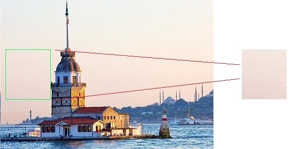
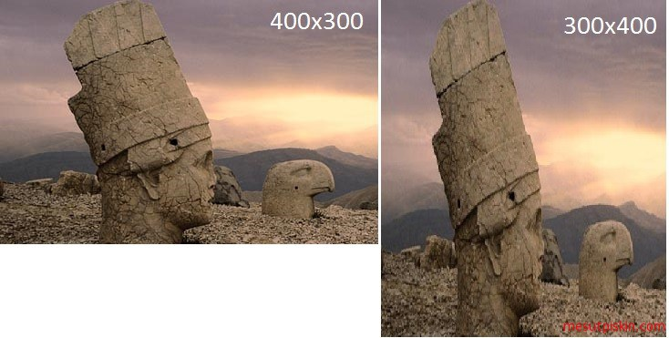

**Görüntü Manüpülasyonu ve Geometrik Dönüşümler** 
----------------------------

**Piksel Manüpülasyonu**

Piksel kavramını daha önce açıklamıştık, pikseller mat nesnesi içerisindeki dizi elemanlarına karşılık gelmektedir. Bir görüntü üzerinde işlem yapmak istediğimizde dizideki elemanları kullanmamız gerekmektedir. OpenCV içerisinde yer alan birçok metot piksel işlemlerini kendisi yapmaktadır. Örneğin bir görüntüyü kopyalamak istediğimizde copy metodunu kullanabiliriz fakat bu metotların nasıl çalıştığını anlamak için veya kendi algoritmanızı geliştirmek zorunda kaldığınızda bu bilgiler işinize yarayacaktır. Basit bir uygulama yazalım ve bu uygulama kameradan okunan görüntüyü mat nesnesi içerisinde tutalım ve bu nesneyi bir başka mat nesnesi içerisine kopyalayarak dosya sistemine kaydedelim. Bu örnek ile bir piksele nasıl ulaşabileceğimizi de öğrenmiş olacağız.

ÖN BİLGİ: Her görüntü renk uzayına göre çeşitli formatlarda, dijital olarak dizi şeklinde tutulur. Her piksel bir dizi elamanıdır ve görüntü üzerinde yapılan her işlem için dizi elemanları arasında dönülür ve istenilen işlem piksel bazında gerçekleştirilir. Görüntü işlemenin temelinde bu vardır.

*Java:*

```Java
public static void main(String[] args) {
		System.loadLibrary(Core.NATIVE_LIBRARY_NAME);
		Mat imageArray = new Mat();
		VideoCapture videoDevice = new VideoCapture();
		videoDevice.open(0);		
		if (videoDevice.isOpened()) {			
			videoDevice.read(imageArray);
			videoDevice.release();
		} else {
			System.out.println("Video aygıtına bağlanılamadı.");
			return;
		}
		//Okunan görüntüyü kopyalamak için yeni bir mat nesnesi
		Mat newimageArray=new Mat();
		/*
		 * Yeni nesnenin satır ve sutun sayısını alınan görüntünün satır sutun sayısına eşitliyoruz
		 * create  metodu ile oluşturakacaj nat nesnesinin satır ve sütünunu veriyoruz.
		*/
		newimageArray.create(imageArray.rows(), imageArray.cols(), CvType.CV_8UC1);
		//Döngü ile alınan görüntü dizisinin tüm elemanları arasında dönüyoruz
		for(int i=0; i<imageArray.rows();i++)
		{
			for(int j=0;j<imageArray.cols();j++)
			{
			/* put ile  verilen indise yani piksele değer atanır
			 * get ile  verilen indisdeki piksel değeri okunur
			 */       
			    newimageArray.put(i, j, imageArray.get(i, j));
			}			
		}
		Imgcodecs.imwrite("KopyaGoruntu.jpg", newimageArray);
		System.out.println("Görüntü dosya sistemine yazıldı.");
	}
```

Bir piksele yani dizi elemanına erişmek için get() metodu, belirli indisteki bir piksele değer yazmak için ise set() metodu kullanılır.

Doğrudan hedef pikselin RGB değerlerini bu şekilde alabilir veya değiştirebiliriz. Unutmamanız gerek bir nokta ise OpenCV de RGB kodları BGR olarak tersen kullanılmaktadır, yani 255 255 0 sarı değerini atamak için 0 255 255 şeklinde tanımlamalıyız, aynı şekilde rgb kodunu çağırdığımızdada 0 255 255 olarak gelecektir.

```Java
double[] rgb = matNesnesi.get(300, 200);
//Renk kodları artık bu dizi içerisinde tutulmaktadır
rgb[0]
rgb[1]
rgb[2]
//255 255 0 RGB kodunu bu 222 333 pikseline atar
matNesnesi.put(222, 333, new double[]{255, 255, 0});
```
RGB yerine  farklı bir renk uzayı kullanılmışsa get metodu o renk uzayının renklerini döndürür. Örneğin siyah beyaz renk uzayına sahip bir görüntü ise, get metodu sonucunda 2 elemanlı bir double dizi oluşacaktır.


Python ile bir örnek yapalım görüntü üzerindeki beyaz pikselleri siyah olarak değiştirelim. Öncelikli olarak görüntüyü okuyup, tüm pikseller içerisinde dönerek RGB renk değeri beyaz yani 255,255,255 olanları bulup RGB siyah yani 0,0,0 ile değiştireceğiz. Burada numpy kütüphanesini de kullanacağız numpy bize çok boyutlu dizilerde kolay işlem yapmayı sağlayan bir kütüphanedir, yeri geldikçe özelliklerine değineceğim.

```Python
import cv2
import numpy as np

 
frame = cv2.imread('turkey-logo.jpg')
#nump ile frame matrisi üzerinde kolayca karşılaştırma ve değer değiştirme yapabiliyoruz
frame[np.where((frame == [255,255,255]).all(axis = 2))] = [0,0,0]
#yeni görüntüyü kaydedelim
cv2.imwrite('turkey-logo-output.jpg', frame)
```

Girdi görüntü:


Çıktı görüntü:


**Görüntü Üzerine Geometrik Çizim**

Mat nesnesi üzerinde çizim yapmak yani dikdörtgen, daire, kare, çizgi çizmek veya metin yazdırmak gibi işlemler için imgproc sınıfı kullanılmaktadır. Bu sınıf içerisinde yer alan metotlardın farklı parametrelere sahip aşırı yüklenmiş (override) alternatifleri bulunmaktadır.

Dikdörtgen çizmek için imgproc içerisindeki rectangle metodunu kullanacağız. Aşağıdaki örnekte dosyadan bir resim dosyası okunuyor ve bu resim dosyası üzerine belirlenen konuma belirlenen renk ile bir kare çiziliyor. İşlemin ardından düzenlenen görüntü tekrardan dosya dizinine yazılıyor.

Point tipinde dikdörtgenin köşe koordinatlarını (x,y), scalar ile de dikdörtgenin rengini veriyoruz. Buradaki önemli nokta renkleri belirtmek için kullandığımız scalar sınıfı. Bu sınıf core paketi içerisinde bulunmaktadır ve RGB renkleri belirtmek için kullanılabilir. Scalar üç parametre almaktadır ve bu parametreler tahmin edebileceğiniz üzer RGB  (Kırmızı Yeşil Mavi) değerleridir. Fakat RGB değerlerini BGR (Mavi Yeşil Kırmızı)olarak tersten vermemiz gerekmektedir.

Not:Point, koordinatları kolay bir şekilde tanımlamak için geliştirilmiş içerisinde x ve y noktalarını barındıran sınıftır. Bir çok programlama dili için ortaktır veya benzerleri mevcuttur. https://docs.oracle.com/javase/7/docs/api/java/awt/Point.html

Çizgi çizmek için ise line() metodu bulunmaktadır. Üzerinde işlem yapılmak için bir mat nesnesi ve point tipinde x, y koordinatları ve rengini parametre olarak almaktadır.

``` Java
Imgproc.line(mat, point, point, color);
cv2.line(...)
```
 

Daire çizmek için circle() metodu bulunmaktadır. Parametre olarak işlem yapılacak mat tipinde görüntü,  point tipinde merkez koordinat, int tipinde yarıçap ve renk almaktadır.

 
``` Java
Imgproc.circle(mat, point, int, color);
cv2.circle(...)
```
 

Çokgen (Poligon) çizmek için polylines() metodu bulunmaktadır. Parametre olarak işlem yapılacak mat tipinde görüntü nesnesi, MatOfPoint tipinde liste olarak köşe koordinatları, bool tipinde açıklık kapalılık durumu ve renk almaktadır. Buradaki isClosed kapalı olarak atanırsa her eğrinin son köşesine bir çizgi çizer.

 
``` Java
Imgproc.polylines(mat, point, isClosed, color);
cv2.polylines(...)
```
 

Yazı yazmak için ise putText() metodu bulunmaktadır.  Parametre olarak işlem yapılacak mat nesnesi, yazılacak olan string metin, point olarak koordinat, metinsel ifadenin fontu, double tipinde fontun ölçeği ve renk almaktadır.

 
``` Java
Imgproc.putText(mat, text, point, fontFace, fontScale, color);
cv2.putText(...)
```
 

Ok çizmek için ise yine çizgi çizmek için kullanılana benzer arrowedLine() metodu bulunmaktadır. Bu metot bir mat nesnesi,  point tipinde 2 adet koordinat ve renk almaktadır.

 
``` Java
Imgproc.arrowedLine(mat, point1, point2, color);
cv2.arrowedLine(...)
```

``` Java
public class Dikdortgen {

	public static void main(String[] args) {

	System.loadLibrary(Core.NATIVE_LIBRARY_NAME);
	Mat goruntuDizisi=new Mat();
	goruntuDizisi=Imgcodecs.imread("C:\\kiz_kulesi.jpg");	
	/* rectangle metodu paramatetre olarak, üzerinde çizim yapılacak bir mat nesnesi
	 * dikdörtgen çizimi için gerekli olan 4 köşenin koordinatı [(x1,y1),(x2,y2)] ve rengini almaktadır.
	 * */
	Imgproc.rectangle(goruntuDizisi, new Point(10,100), new Point(100,200),new Scalar(76,255,0));
	Imgcodecs.imwrite("C:\\Yeni_kiz_kulesi.jpg", goruntuDizisi);
	System.out.println("Düzenlenen görüntü dosya sistemine yazıldı.");
	}
}
```


*Python:*

```Python
import cv2
frame = cv2.imread('turkey-logo.jpg')
cv2.line(frame,(0,0),(511,511),(255,255,0),5)
cv2.rectangle(frame,(384,0),(510,128),(0,255,255),3)
cv2.imshow("Cikti",frame)
cv2.waitKey(0)
```


**Görüntü Kırpma**

Biraz önce matris üzerinde çizim işlemlerinde kız kulesi üzerine bir dikdörtgen çizmiştik, şimdi bir örnek yapalım ve bu geometrik şekillerin kullanım alanlarını daha iyi kavrayalım.  Bir dikdörtgen nesnesi oluşturacağız ve okunana görüntüyü bu dikdörtgen boyutlarında kırparak görüntü içerisinden çıkartacağız.

*Java:*

```Java
public static void Kirp(String[] args) {

		System.loadLibrary(Core.NATIVE_LIBRARY_NAME);

		Mat goruntuDizisi = new Mat();
		goruntuDizisi = Imgcodecs.imread("C:\\kiz_kulesi.jpg");
		//Dikdörtgen olluşturuyoruz ve koordinatlarını belirliyoruz
		Rect dikdortgen=new Rect(new Point(10,100),new Point(100,200));
		//Yeni bir mat nesnesi oluşturuyoruz ve okunan görüntüye dikdörtgen ebatlarında kırpma işlemi uyguluyoruz
		Mat yeniGoruntu=new Mat(goruntuDizisi,dikdortgen);	         
		Imgcodecs.imwrite("C:\\Yeni_kiz_kulesi.jpg", yeniGoruntu);
		
	}
```

*Python:*

```Python
import cv2
frame = cv2.imread("kiz_kulesi.png")
#Alınan görüntüyü 10,100 - 100,200 şeklinde kırp
kesilmis_frame = frame[10:100, 100:200]
cv2.imshow("Kırpilmis Goruntu", kesilmis_frame)
cv2.waitKey(0)

```




**Yeniden Boyutlandırma**

Bazı durumlarda okunan görüntünün tekrardan boyutlandırılması istenilebilir bunun için imgproc sınıfı içerisinde resize() metodu bulunmaktadır. Parametre olarak giriş mat nesnesi, çıkış mat nesnesi ve size olarak boyut almaktadır.




*Java:*

```Java
System.loadLibrary(Core.NATIVE_LIBRARY_NAME );	
Mat kaynak = Imgcodecs.imread("C:\\1.jpg");
Mat hedef = new Mat(); 
//Görüntünün boyutlarını 300x400 yapalım      
Imgproc.resize(kaynak, hedef, new Size(300,400));       
Imgcodecs.imwrite("C:\\2.jpg", hedef);	
```

*Python:*

```Python
import numpy as np
import cv2 as cv
img = cv.imread('turkey-logo.jpg')
height, width = img.shape[:2]
#Orijinal boyutunu 2 kat büyütelim (2*width, 2*height)
sonuc = cv.resize(img,(2*width, 2*height), interpolation = cv.INTER_CUBIC)
cv.imshow("Boyutlandirilmis Goruntu", sonuc)
cv.waitKey(0)
```
